# Coupled Water Fluxes and Pore Scale Dynamics under Joint Precision Irrigation and Evaporation Control Mulching: Mapping Non Linear Soil to Atmosphere Feedback Loops

  

**Author:** Naziru Halilu

## Problem, Methodology, and Results

**Workflow sketch**

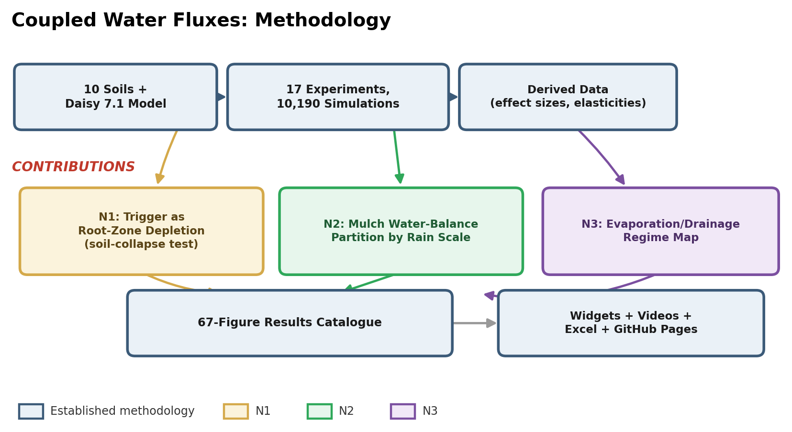

[View interactive results catalogue online](https://halilunaziru73-creator.github.io/Coupled-Water-Fluxes-Pore-Scale-Dynamics-Precision-Irrigation-Mulching-Feedback-Loops/Results/04_Interactive_Charts/index.html)

### Problem

Precision irrigation and evaporation control mulching are usually studied and tuned one soil at a time, so a trigger setting, sensor depth or mulch strength that works well on one soil is often reported without stating how much of that result is the management choice and how much is simply the soil's own pore structure acting underneath it. Two practical questions follow directly from this gap. First, when a fixed suction based trigger (for example, minus 300 cm) is deployed across different soils, does it protect yield equally well everywhere, or does it silently allow far more depletion on some soils than others. Second, when mulching saves soil evaporation, is that saved water reliably converted into less irrigation, or can it just as easily end up as extra drainage and nitrate loss depending on the season. This project uses one process based model, one consistent experimental design and ten physically distinct soils to answer both questions directly rather than inferring them from separate single soil studies.

### Methodology

All simulations were run in Daisy 7.1 (University of Copenhagen), a one dimensional, Richards equation, soil, plant, atmosphere model with van Genuchten to Mualem unsaturated hydraulics and the WEPP dynamic structure model for tillage and consolidation effects on pore structure over time. Ten soils spanning sand to silty clay loam (USDA texture, Ap and Bt horizons) were simulated under two weather records, Taastrup, Denmark, 1980 to 1999, and Bologna, Italy, 1994 to 2005, used for the Mediterranean nitrogen and water experiment.

**10,190 simulations across 17 experiments (E0 to E16):**

| Experiment | Name | Runs | What was varied |
|---|---|---:|---|
| E0 | Baselines | 10 | Rainfed baseline, one run per soil |
| E1 | Dose | 200 | Irrigation dose x duration, all soils |
| E2 | Trigger pressure | 200 | Irrigation trigger suction, all soils |
| E3 | Sensor depth | 200 | Soil moisture sensor installation depth |
| E4 | Methods | 100 | Irrigation method (overhead, surface, drip at three depths) |
| E5 | SHP dynamics | 300 | Tillage system x structural consolidation rate |
| E6 | Mediterranean pollution | 210 | N rate x water strategy, Bologna climate |
| E7 | Mulching | 200 | Mulch vapour flux factor x interception capacity |
| E8 | Rain intensity, moisture | 1,000 | Rain intensity x initial soil moisture |
| E9 | Soil moisture, rain | 1,000 | Initial suction x rain scale x soil |
| E10 | Amount, timing, soil | 1,000 | Irrigation amount per event x timing window x soil |
| E11 | Temperature, evaporation, rain | 1,000 | Temperature shift x soil evaporation factor x rain scale |
| E12 | Sensor, trigger, rain | 1,000 | Sensor depth x trigger x rain scale |
| E13 | N, water, soil | 1,000 | N rate x water strategy x soil |
| E14 | Mulch, rain | 1,000 | Mulch vapour flux factor x interception capacity x rain scale |
| E15 | Method, depth, amount | 1,000 | Irrigation method x rooting depth x amount |
| E16 | Edge cases | 770 | 77 stress tested factorial edge cases per soil |

149 runs across all experiments were flagged as solver failures and excluded from every analysis in this repository. Daisy reports this status itself, from its own Richards equation solver, when the numerical scheme cannot converge on a stable timestep for the water flux being simulated; it is not a data processing artifact. Richards equation is numerically stiff on coarse textured soils, because their unsaturated conductivity K(theta) changes by several orders of magnitude over a small change in water content (Fig. 12), so a solver has to take very small timesteps to stay stable whenever the surface is being pushed through that steep part of the curve quickly. That is exactly what a large irrigation dose applied over a short duration, or a large amount per event on a tight timing window, does on sand, loamy sand or coarse sand: it forces a big change in surface water content in a short time on the soils least able to absorb it smoothly (Figs. 32 and 33 show the resulting blank tiles concentrated on exactly these soils). The 770 run edge case experiment (E16), designed to stress test every factor at once, fails for the same reason at a higher rate (30 of 770) than the gentler experiments, because pushing several factors to their extremes simultaneously is more likely to hit this same numerical limit than varying one factor at a time. Irrigation efficiency (IE) and irrigation water use efficiency (IWUE) are reported only where annual irrigation is at least 20 mm. 36 setups were re simulated at daily resolution in Daisy 7.1.14 to support the daily and per year figures; these reproduce the original batch results within 2 percent, median difference under 0.3 percent.

### Results

- How strongly management can steer drainage depends on soil pore structure. Controllability of drainage by the irrigation trigger, dose, method, N to water pathway and mulch rises with plant available water (Spearman rho +0.79 to +0.95 across 10 soils); soil structure is the only lever that works the other way (rho minus 0.58). On coarse sands the irrigation levers barely move drainage at all.
- A fixed suction trigger means very different things on different soils: minus 300 cm is 84 percent of available water depleted in sand but only 24 percent depleted in silty clay loam. Expressed as root zone depletion instead of suction, irrigation and yield responses from all ten soils collapse onto single curves.
- +1 degree C is associated with about +46 mm/yr more irrigation and +57 mm/yr more evapotranspiration; +1 percent more rain is associated with about minus 3.0 mm/yr less irrigation.
- Mulch savings are convex in mulch strength; each additional mm of soil evaporation saved is associated with roughly 0.6 to 0.9 mm less irrigation, but the split between reduced irrigation and extra drainage depends strongly on how wet the season is.
- Every mm of irrigation is associated with about 0.21 mm more drainage; every mm of drainage is associated with about 1.06 kg N/ha more nitrate leached.
- 170 runs are Pareto optimal across three objectives at once: maximum irrigation efficiency, minimum drainage fraction and minimum nitrogen leaching fraction.

## Novel contributions to the literature

1. **A soil independent irrigation trigger law.** The current, conventional practice sets one fixed suction threshold (for example, minus 300 cm) and applies it across every soil, which this dataset shows is not soil independent at all: that same minus 300 cm is 84 percent of available water depleted in sand but only 24 percent depleted in silty clay loam. Re expressed as root zone depletion rather than suction, irrigation and yield responses from ten physically distinct soils collapse onto single curves (pooled R squared rises from 0.48 to 0.75 for irrigation and from 0.23 to 0.70 for yield), and the collapse converts directly into a per soil sensor suction table so one depletion target can be deployed as ten different, soil specific tension settings.
   **Watch:** [Tensiometer widget, suction at 20 cm, 1980 to 2000, drag the range slider](https://halilunaziru73-creator.github.io/Coupled-Water-Fluxes-Pore-Scale-Dynamics-Precision-Irrigation-Mulching-Feedback-Loops/Results/04_Interactive_Charts/05_Sensor_widget_1980_2000.html) · [V1, sensor and irrigation, 1994 (video)](https://halilunaziru73-creator.github.io/Coupled-Water-Fluxes-Pore-Scale-Dynamics-Precision-Irrigation-Mulching-Feedback-Loops/Results/05_Videos/V1_Sensor_and_irrigation_1994.mp4) · [E12, irrigation demand by sensor depth x trigger, slider = rain](https://halilunaziru73-creator.github.io/Coupled-Water-Fluxes-Pore-Scale-Dynamics-Precision-Irrigation-Mulching-Feedback-Loops/Results/04_Interactive_Charts/03_E12_Sensor_Trigger_Rain.html)

   **NOVEL CONTRIBUTION** -> [Jump to Figure 2](#fig-trigger-law)
2. **A closed water balance account of where evaporation saved by mulching actually goes.** In dry years about 60 percent of the water saved from evaporation is redirected into reduced irrigation; in wet years about 63 percent instead becomes extra drainage, with the crossover between the two regimes located at a specific rainfall scale (about 1.2 times the baseline).
   **Watch:** [E14, soil evaporation under mulch, slider = rain](https://halilunaziru73-creator.github.io/Coupled-Water-Fluxes-Pore-Scale-Dynamics-Precision-Irrigation-Mulching-Feedback-Loops/Results/04_Interactive_Charts/04_E14_Mulch_3D_surface.html) · [V4, mulch vs bare soil, 1994 (video)](https://halilunaziru73-creator.github.io/Coupled-Water-Fluxes-Pore-Scale-Dynamics-Precision-Irrigation-Mulching-Feedback-Loops/Results/05_Videos/V4_Mulch_vs_bare_1994.mp4)

   **NOVEL CONTRIBUTION** -> [Jump to Figure 3](#fig-mulch-water-balance)
3. **A regime map of when the dominant water loss pathway switches from evaporation to drainage**, and where climate and mulch management drivers stop acting additively on that pathway, with the non additive share reaching up to 15 percent of irrigation at the climate extremes.
   **Watch:** [E11, temperature x rain response surfaces, slider = soil evaporation factor](https://halilunaziru73-creator.github.io/Coupled-Water-Fluxes-Pore-Scale-Dynamics-Precision-Irrigation-Mulching-Feedback-Loops/Results/04_Interactive_Charts/01_E11_Temp_Rain_Evap_3D_surfaces.html) · [E14, soil evaporation under mulch, slider = rain](https://halilunaziru73-creator.github.io/Coupled-Water-Fluxes-Pore-Scale-Dynamics-Precision-Irrigation-Mulching-Feedback-Loops/Results/04_Interactive_Charts/04_E14_Mulch_3D_surface.html) · [V5, feedback trajectories, 1994 (video)](https://halilunaziru73-creator.github.io/Coupled-Water-Fluxes-Pore-Scale-Dynamics-Precision-Irrigation-Mulching-Feedback-Loops/Results/05_Videos/V5_Feedback_trajectories_1994.mp4)

   **NOVEL CONTRIBUTION** -> [Jump to Figure 4](#fig-regime-map)

Each of these builds on established concepts in unsaturated flow theory and irrigation scheduling practice (similar media scaling, FAO 56 management allowed depletion, standard soil water balance accounting); the specific demonstrations, the cross soil data collapse, the closed rainfall conditioned water balance partition and the explicit non additivity mapping, are, to our knowledge, new for a Daisy type model. None of the three claims has been checked exhaustively against the wider literature, and they should be read as a new synthesis of this dataset rather than a claim that no related result exists elsewhere.

## Symbol and abbreviation key

| Symbol | Meaning |
|---|---|
| IE | Irrigation efficiency: yield (kg dry matter) per cubic metre of irrigation applied |
| IWUE | Irrigation water use efficiency: yield per cubic metre of total water (rain plus irrigation) |
| DPF | Deep percolation fraction: drainage below 1 m as a fraction of total water input |
| NLF | Nitrogen leaching fraction: nitrogen leached as a fraction of nitrogen applied |
| PFPn | Partial factor productivity of nitrogen: yield per kg of nitrogen applied |
| TAW | Total available water: plant available water capacity in 0 to 100 cm, field capacity minus wilting point |
| f | Root zone depletion fraction: share of TAW already used, 0 = full, 1 = at wilting point |
| h | Soil water pressure head (suction), cm; negative by convention, reported here as magnitude |
| pF | log10 of suction in cm; pF 2 is approximately field capacity, pF 4.2 is approximately wilting point |
| Ksat | Saturated hydraulic conductivity |
| K(Se), K(h) | Unsaturated hydraulic conductivity as a function of effective saturation or suction |
| vff | Mulch vapour flux factor: 1 = no mulch, lower values = stronger evaporation suppression |
| cap | Mulch or litter layer interception capacity, mm |
| Ep, EpFactor | Soil evaporation factor: multiplier on potential soil evaporation |
| trig | Irrigation trigger: the suction or depletion value that starts an irrigation event |
| E0 to E16 | Experiment identifiers; see the experiment table above |
| rho | Spearman rank correlation coefficient |
| R squared | Coefficient of determination |
| N1, N2, N3 | The three novel synthesis figures (trigger law, fate of saved evaporation, feedback regime map) |

## Repository structure

| Folder | Contents |
|---|---|
| `Results/00_Key_Synthesis_Figure` | The integrating figure above |
| `Results/00_Novel_Contributions` | Three further synthesis figures (N1 trigger law, N2 fate of saved evaporation, N3 feedback regime map) |
| `Results/01_Charts_50` | 50 charts in 8 themes: system & forcing, pore-scale proxies, coupled fluxes, irrigation control, mulching, non-linear feedbacks, nitrogen, synthesis |
| `Results/02_Additional_Figures` | 13 figures: texture triangle, pore domains, seasonal envelopes, evaporation decline, model structure, PCA, random forest, validation, … |
| `Results/03_Excel_Analysis` | `Results_Analysis.xlsx`: all runs + 8 analysis sheets with live formulas and native charts |
| `Results/04_Interactive_Charts` | 8 interactive HTML pages (start with `index.html`) |
| `Results/05_Videos` | 5 MP4 animations (sensor, profiles, tillage, mulch, feedback trajectories) |
| `Results/06_3D_Project` | Moving 3D model of the system (MP4) and an interactive 3D version |
| `Results/07_Derived_Data_Tables` | Effect sizes, elasticities, Pareto-optimal runs, controllability tables |
| `Results/08_Scripts` | Python code that produced every figure |
| `Results/Figure_Catalogue.csv` | Title, caption and data source of every figure |

## Note on scale

Daisy is a Darcy scale model; the "pore scale dynamics" referred to throughout this repository are represented through validated proxies derived from the van Genuchten to Mualem parameters (pore size distribution from n and alpha, unsaturated conductivity K(Se), and dynamic bulk density from the WEPP structure model), not a directly resolved pore network.

## Viewing

Figures are PNG (220 dpi). Interactive pages work offline; keep `plotly.min.js` in the same folder. With GitHub Pages enabled on this repository, the interactive charts can also be opened online.

## Figure-by-figure results and why they happen

All 67 figures, in catalogue order, each with the mechanism behind the pattern. The four figures in **New Synthesis** and the key synthesis figure additionally give the supporting literature and argue explicitly for what is new about the approach; treat the novelty claims as offered, not as checked exhaustively against the literature (see the caveats in each entry and in the project README).

### Key Synthesis Figure (00_Key_Synthesis_Figure)

**Figure 1. Soil pore structure gates management controllability**

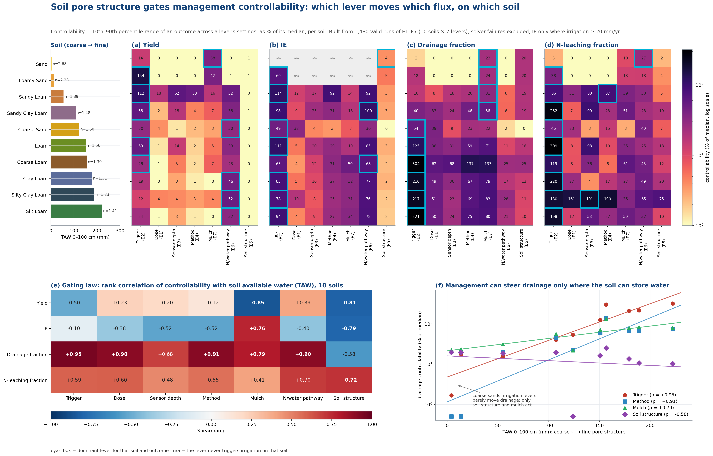

*Controllability of yield, IE, drainage and N-leaching fractions by seven management levers across ten soils, and its rank correlation with plant-available water.* (data: E1-E7)

**Why this happens.** Controllability here means how much an outcome moves when a lever is changed, as a percentage of its own median. A lever can only move drainage if the soil has somewhere to put the water it withholds or releases: on a soil with a large plant-available water capacity (TAW), delaying or advancing irrigation changes how much water is stored in the root zone versus lost below it, so the trigger, dose, method and N/water pathway all show strong positive rank correlation with TAW (ρ = +0.79 to +0.95, panel e). On coarse sand, water passes through the profile in days regardless of when or how it is applied, so those same levers barely move drainage at all (panel f): the soil's pore network sets an upper bound on what management can achieve before any lever is even considered. Soil structure is the one exception, and it runs the opposite way (ρ = −0.58): it is the only lever that changes the pore network itself rather than working within it, so it matters most exactly where the other levers matter least, on coarse soils with little water-holding capacity to begin with. Yield and irrigation efficiency follow the reverse logic: they are most controllable on the driest, lowest-TAW soils, because a small change in water supply or evaporative demand there is a large fraction of what the crop has to work with.

**Idea and literature.** This follows directly from unsaturated flow theory: Miller and Miller's (1956) similar-media scaling and the van Genuchten (1980)/Mualem (1976) hydraulic functions used throughout this study both predict that a soil's characteristic pore-size distribution sets its retention and conductivity behaviour, and therefore how it responds to any external forcing. Irrigation scheduling research has long shown, soil by soil, that coarse soils need more frequent, smaller applications (the logic behind FAO-56's management-allowed-depletion approach, Allen et al., 1998) and that structural degradation reduces infiltration and available water capacity (captured here through the WEPP dynamic structure model, Flanagan and Nearing, 1995). What is usually shown, however, is that management effect sizes differ by soil. This figure instead asks a comparative question directly: for a fixed outcome, which lever dominates, on which soil, and does the ranking itself change with soil physical properties. Reducing seven experiments and ten soils to one soil × lever controllability map with a single explanatory variable (TAW) is, to our knowledge, not how Daisy or comparable crop-model studies have presented management sensitivity before; related work has looked at single-lever sensitivity per soil, not a cross-lever ranking gated by a soil property. It has not been checked against the full literature and should be read as a new synthesis of this dataset, not a claim that no related idea exists.

### New Synthesis Figures (00_Novel_Contributions)

The three results argued for in full under "Novel contributions to the literature" near the top of this README, the soil independent trigger law, the closed water balance account of saved evaporation, and the feedback regime map, each with a figure below.

**Figure 2. Soil-independent trigger law (data collapse)**

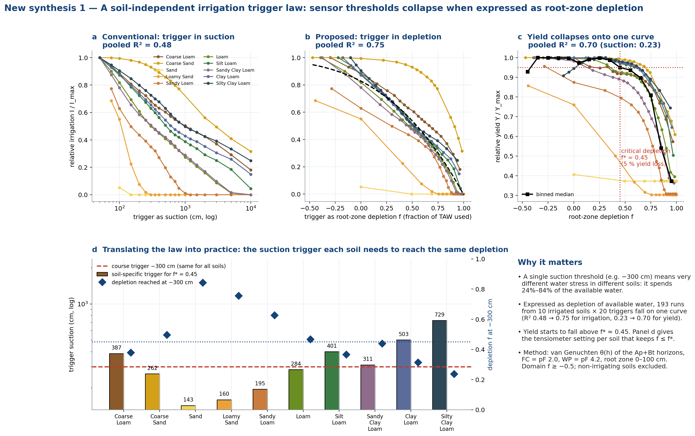

*E2 (10 soils × 20 triggers): relative irrigation and yield collapse onto single curves when the trigger is expressed as root-zone depletion f instead of suction; f* = 5 % yield-loss threshold and the soil-specific suction triggers that achieve it.* (data: E2 + soil hydraulics)

**Why this happens.** A suction-based trigger (e.g. −300 cm) is a single number, but the same tension corresponds to a very different fraction of available water depending on the retention curve: in sand, −300 cm is already 84 % depletion (h* = −143 cm gets you to 5 % yield loss); in silty clay loam, the same −300 cm is only 24 % depletion (h* = −729 cm). This is exactly why the conventional plot (panel a, trigger in suction) scatters across soils, R² = 0.48, because the x-axis is not measuring the same underlying quantity in every soil. Root-zone depletion f, the fraction of plant-available water already used, is that same-footing quantity: it is defined relative to each soil's own field capacity and wilting point, so a given f means the same amount of remaining accessible water regardless of texture. Re-expressing the trigger this way collapses the irrigation curves onto one line (panel b, R² = 0.75) and the yield curves even more tightly (panel c, R² = 0.70 vs 0.23 in suction), because yield loss begins once the crop has used a soil-independent share of what it can extract, not once suction crosses a soil-specific number.

**Idea and literature.** This is the same physical idea behind FAO-56 management-allowed depletion (Allen et al., 1998), which already recommends scheduling by depletion fraction rather than by a fixed tension, and behind Miller and Miller (1956) similar-media scaling, which formalises why two soils with different pore-size distributions require different absolute suctions to reach comparable relative water status. What this figure adds is a direct, data-driven test of that idea across ten simulated soils and twenty trigger settings from one consistent model run: it shows the R² gain from switching variables explicitly (0.48 → 0.75, 0.23 → 0.70) rather than assuming depletion is the better variable, and it turns the collapse into an operational table (panel d) of the suction each soil's sensor should actually be set to in order to reach the same 5 %-yield-loss depletion point. We are not aware of a published soil-independent trigger law demonstrated this way for Daisy specifically, but the underlying concept (schedule by depletion, not by tension) is established practice, and the claim here is the demonstration and the soil-specific suction table, not the invention of the depletion concept itself.

**Figure 3. Fate of water saved by mulching**

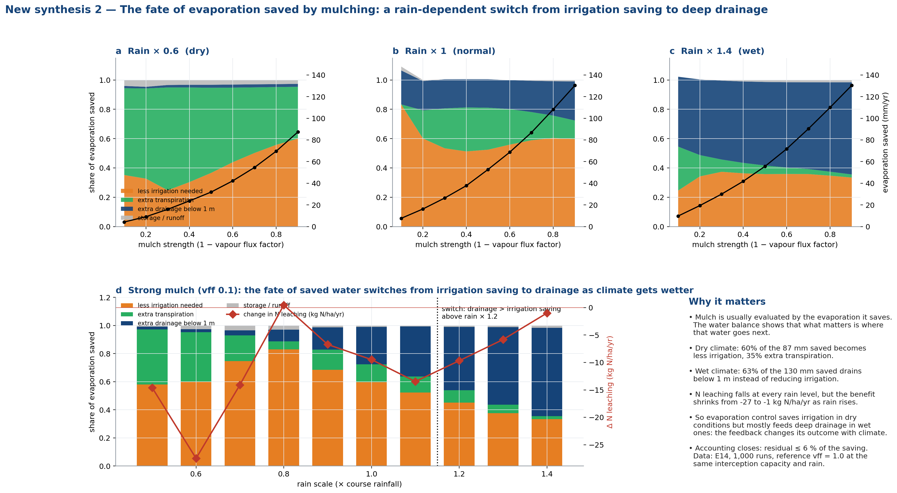

*E14: total evaporation saved (soil + canopy + mulch layer) partitioned by water balance into reduced irrigation, extra transpiration, extra drainage and residual, vs mulch strength and rain; with the resulting change in N leaching.* (data: E14)

**Why this happens.** Mulch reduces the vapour-flux factor at the soil surface, so soil evaporation falls by a physically fixed amount for a given mulch strength, but where that saved water goes afterwards is decided by the water balance, not by the mulch itself. In a dry year (rain ×0.6), the crop is water-limited and the profile has spare storage capacity, so most of the saved water (about 60 % of ≈87 mm) is redirected into less irrigation being applied, with the rest going to extra transpiration. In a wet year (rain ×1.4), the profile is already close to field capacity, so it cannot absorb more; instead of reducing irrigation, the saved water simply adds to the surplus that drains below 1 m (63 % of ≈130 mm, panel c). The crossover between these two regimes, drainage overtaking irrigation-saving as the dominant fate, sits near rain ×1.2 (panel d). Nitrate leaching keeps falling at every rain level because less evaporation always means somewhat less concentrated soil water, but the size of the benefit shrinks in wet years because the extra drainage carries part of that nitrate straight out of the root zone, offsetting the gain from applying less fertiliser-linked irrigation.

**Idea and literature.** Mulch's effect on evaporation is well established (surface residue and plastic mulch studies going back decades consistently report reduced soil evaporation and water savings, broadly summarised in agronomy and soil-physics reviews of mulching). What is less commonly quantified is a full water-balance accounting of the saved evaporation itself: most mulch studies report the evaporation reduction or the resulting yield/water-use benefit, not a four-way partition (irrigation saved, extra transpiration, extra drainage, residual) tracked across a rainfall gradient with a closed balance (residual ≤ 6 %) and linked through to the nitrate consequence. That closed-balance, rainfall-conditioned partition, and the explicit statement that mulch's practical benefit changes character (and shrinks) as climate gets wetter, is the new synthesis offered here. Similar water-balance accounting ideas exist in the mulch literature; we have not found this specific rain-gated partition demonstrated with a process-based model in this form, but this has not been checked exhaustively against the literature.

**Figure 4. Feedback regime map and non-additivity**

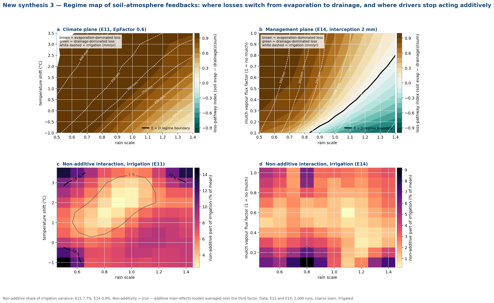

*Loss-pathway index (evaporation vs drainage dominance) across climate (E11) and mulch-management (E14) planes, with the regime boundary E = D, irrigation contours, and maps of where drivers interact non-additively.* (data: E11, E14)

**Why this happens.** Evaporation and drainage are two competing exits for the same water: evaporation is atmosphere-driven and acts at the surface, drainage is gravity-driven and acts once the profile is full. Which one dominates is therefore a balance, not a fixed property of the system. Hotter, drier conditions and less surface cover push the balance toward evaporation (brown region, panels a-b) because atmospheric demand is high and there is little surplus water to drain; wetter conditions and stronger mulch push it toward drainage (green region) because evaporation is suppressed exactly where there is already more water than the profile can hold. The black contour in each panel marks the line where the two losses are equal, so its position and slope summarise, in one line, how climate and management jointly decide the dominant loss pathway. The non-additive maps (panels c-d) show something distinct: because both drivers act on the same soil-water store rather than on independent pools, their combined effect is not the sum of their individual effects. The interaction is largest at the hot/dry and cold/dry extremes (up to 15 % of irrigation), precisely where the store is smallest and therefore most sensitive to how two drivers compete for it at once.

**Idea and literature.** Partitioning evapotranspiration and drainage as competing water-balance terms is standard practice (e.g. FAO-56 soil water balance, Allen et al., 1998); what is not standard is mapping the regime boundary between them as an explicit function of two drivers at once (climate in panel a, management in panel b) and separately quantifying non-additivity, the part of the combined response that a single-factor sensitivity analysis would miss entirely. Sensitivity-analysis methods that decompose variance into main effects and interactions (in the spirit of Sobol'/ANOVA-type decompositions, applied here in Fig. 67) are established, but applying that logic specifically to locate where the evaporation/drainage regime boundary sits and where interactions are largest is, to our knowledge, a new combination for this kind of dataset. As with the other synthesis figures, this is offered as a new reading of the results rather than a claim that no related work exists in the broader feedback-loop or crop-model sensitivity literature.

### 50 Charts in 8 Themes (01_Charts_50)

#### A. System, Forcing and Baseline

**Figure 5. Feedback loops with data-derived effect sizes**

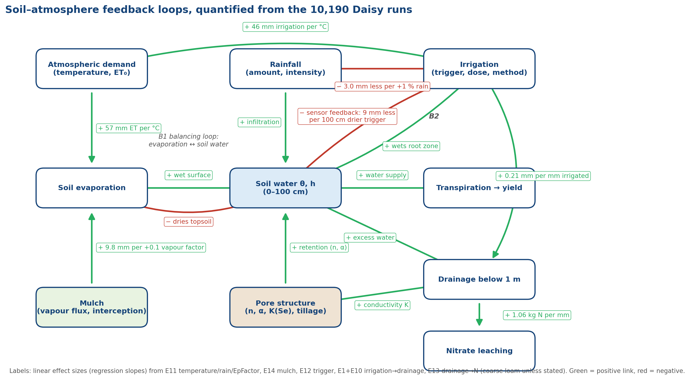

*Causal-loop diagram; arrow labels are regression slopes from E11, E14, E12, E1/E10 and E13.* (data: E1,E10-E14)

Every arrow is a regression slope taken from the simulations, so the diagram is a quantified map of how the system reinforces or damps itself. Warmer air raises atmospheric demand, which increases evaporation and transpiration (+57 mm ET per °C) and dries the root zone, so the irrigation controller applies more water (+46 mm per °C). This is a balancing loop (B1): irrigation restores soil water, which feeds back on evaporation. Rain works in the opposite direction (−3.0 mm irrigation per +1 % rain), and a drier sensor threshold reduces irrigation (about 9 mm less per 100 cm). Downstream, every mm of irrigation adds 0.21 mm of drainage, and every mm of drainage carries 1.06 kg N out of the root zone. Mulch closes a second loop by lowering the evaporative demand on the topsoil (+9.8 mm soil evaporation per +0.1 in vapour-flux factor).

**Figure 6. Experiment design matrix**

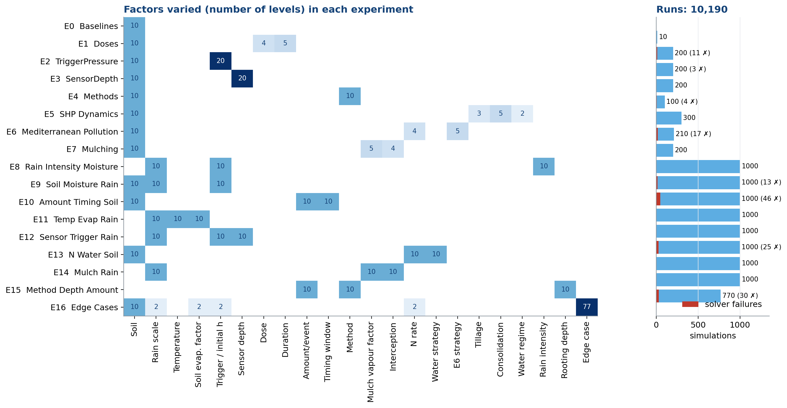

*Number of levels of each factor per experiment (from the run names) and the number of simulations; red = runs excluded for solver failure.* (data: All)

This is the map of the whole study. Each row is an experiment and each column a factor; the number in a cell is how many levels of that factor were varied, and the bars on the right give the number of simulations per experiment (10,190 in total). Red marks the 149 runs flagged as solver failures, which are excluded everywhere. No single experiment varies everything, but soil, rain, trigger and sensor depth recur across experiments, which is what lets later figures compare management levers on common ground and explains why the synthesis figures pool E1-E7 or E10-E16 rather than a single experiment.

**Figure 7. Climate forcing**

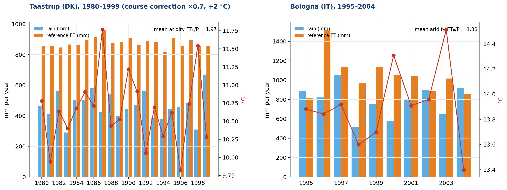

*Annual rain, reference ET and temperature for the two climates used (Taastrup: E0 to E5, E7 to E16; Bologna: E6).* (data: Weather files, E0)

Weather drives everything downstream. Taastrup is a temperate site where annual rain (roughly 300-650 mm) is well below reference evapotranspiration (about 800-900 mm after the ×0.7 course correction and +2 °C), giving a mean aridity ET₀/P of 1.97, so the crop is water-limited in most years and irrigation matters. Bologna is warmer with a lower aridity index (1.38) but much larger year-to-year swings in rain, which is why it is used as the Mediterranean nitrogen-and-water case (E6). What makes irrigation useful is the mismatch in timing between when rain falls and when the crop needs water, not the annual totals alone.

**Figure 8. Rainfed yields per year and soil**

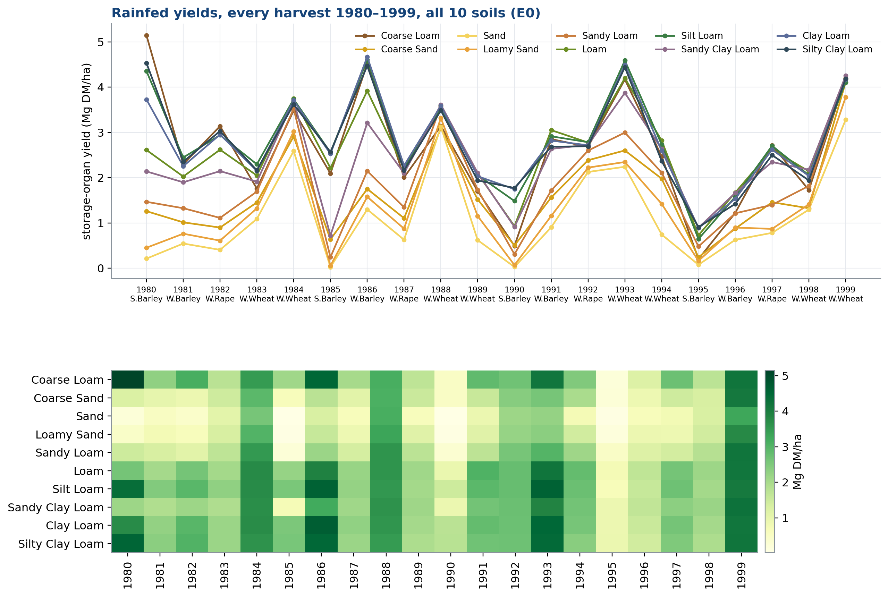

*Harvest-by-harvest yields from the E0 baselines (re-run for per-year output; matches the user's runs within 0.4 %).* (data: E0)

Rainfed yield follows water availability. Dry years (the dips around 1985, 1990 and 1995) depress every soil, while wet years lift them, and the alternation of spring barley, winter barley, winter rape and winter wheat adds a crop-specific pattern. The sandy soils yield least and vary most, because their small plant-available water capacity means the crop runs out of stored water within a few dry weeks, whereas loams and silty soils buffer the same weather. This year-to-year spread is the baseline against which every irrigation benefit in later figures is measured.

**Figure 9. Rainfed water balance per soil**

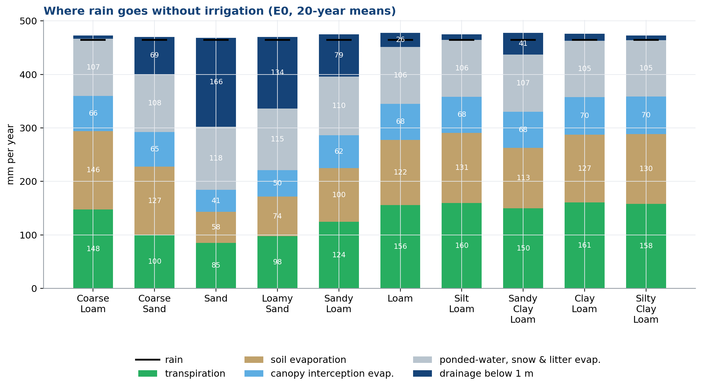

*Mean annual partitioning of rain in the 10 rainfed baselines.* (data: E0)

Rain has several possible fates, and soil texture decides how it is split. Fine and medium soils hold water in the root zone long enough for transpiration (about 155-160 mm on loams and silt loams), whereas sand transpires only about 85 mm and loses 166 mm to drainage below 1 m, because water passes through its large, poorly retentive pores before roots can use it. Soil evaporation is also lower in sand (58 mm against 146 mm in coarse loam): its conductivity collapses as the surface dries (Fig. 12), so it cannot resupply the surface from below. Interception and ponded-water losses (about 105-118 mm) are similar everywhere because they depend on the canopy and surface, not on soil hydraulics.

#### B. Pore-Scale Proxies and Structure

**Figure 10. Retention curves of the 10 soils**

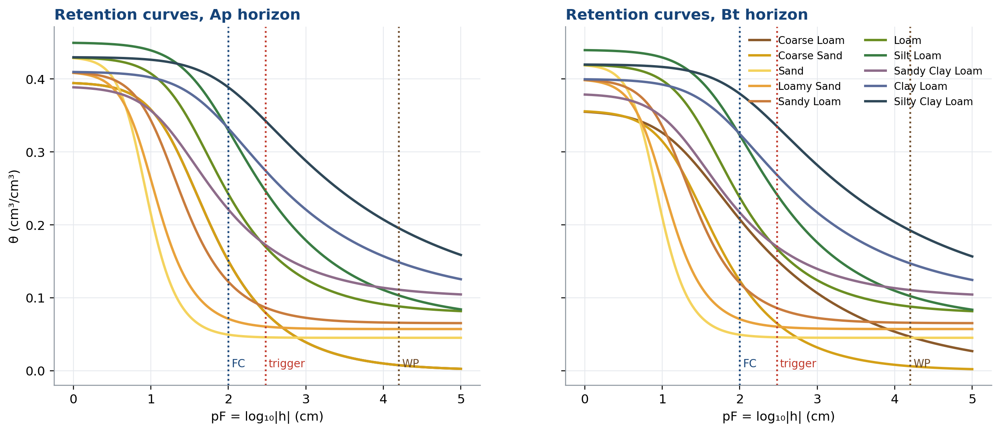

*van Genuchten θ(h) with field capacity (pF 2), the −300 cm trigger and wilting point (pF 4.2).* (data: Soil files)

A retention curve shows how tightly a soil holds water at a given suction. Sands release almost all their water over a narrow suction range, so little is left between field capacity (pF 2) and wilting point (pF 4.2), while fine-textured soils release water gradually because they contain many small pores; this is why plant-available water differs so much between soils. The red dotted line, the −300 cm irrigation trigger, therefore falls on an almost empty part of the curve in sand but on a well-filled part in silty clay loam. The same trigger means very different plant stress on different soils, which is the starting point of the trigger law in Fig. 2.

**Figure 11. Pore-size distribution**

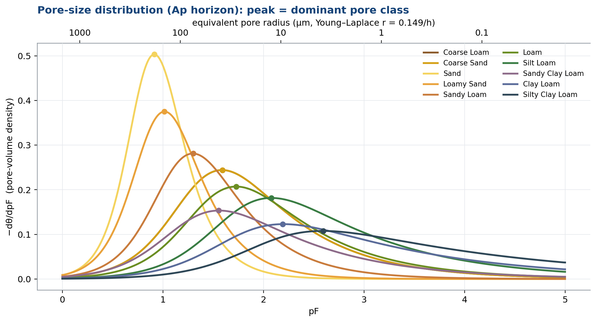

*Derivative of the retention curve (−dθ/dpF) for each soil; top axis converts suction to equivalent pore radius.* (data: Soil files)

The peak marks the dominant pore class. Sand has a tall, narrow peak at low suction (pF ≈ 0.9, equivalent pore radius of roughly 200 µm), meaning almost all of its water sits in large pores that drain freely. Silty clay loam has a low, broad peak near pF 2.6 (about 4 µm) with a long tail to high suction, meaning a wide mix of pore sizes and strong capillary holding. Pore size sets both how much water is retained and how fast it moves, so this is the pore-scale explanation behind the differences in Figs. 9, 10 and 12. The pore radii come from the Young-Laplace relation applied to the van Genuchten parameters, so they are a proxy for pore structure, not a measured pore network.

**Figure 12. Unsaturated conductivity**

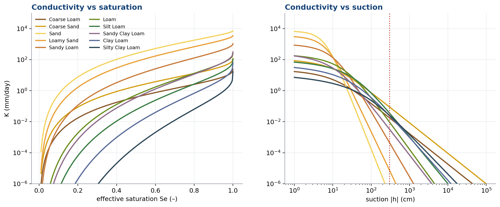

*Mualem to van Genuchten K(Se) and K(h) (Ap horizon), mm/day; dotted line = trigger.* (data: Soil files)

Texture matters in both directions. At saturation sand conducts water fastest (roughly 10³-10⁴ mm/day), but as it dries its conductivity collapses by many orders of magnitude within a small suction range, because the large pores that carried the flow empty first and the remaining water films are thin and disconnected. Finer soils start lower but lose conductivity gradually because their small pores stay water-filled. At the −300 cm trigger (dotted line) the fine soils therefore still conduct more water than sand, so they can resupply the roots and the surface from below, while sand cannot. This is the physical reason sand has both low evaporation and high drainage.

**Figure 13. Available water, air entry and Ksat**

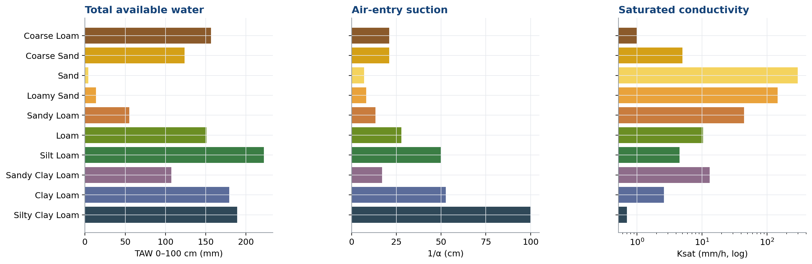

*Soil-physical indicators computed from the hydraulic parameters of each soil.* (data: Soil files)

These three bars summarise each soil's pore structure in three numbers, and they pull in opposite directions. Fine silty soils hold the most plant-available water (silt loam ≈ 220 mm in 0-100 cm) because they have many pores that retain water against gravity yet release it to roots; sand holds almost none, because its large pores drain at very low suction. Air-entry suction (1/α) is largest for the finest soils (about 100 cm in silty clay loam against about 7 cm in sand), so they stay saturated longer as suction rises. Saturated conductivity runs the other way: sand passes several hundred mm/h, silty clay loam under 1 mm/h. High Ksat means water moves through quickly; high TAW means it stays. The balance between the two is behind most later results, including the controllability map in Fig. 1.

**Figure 14. Topsoil conductivity and water content over time**

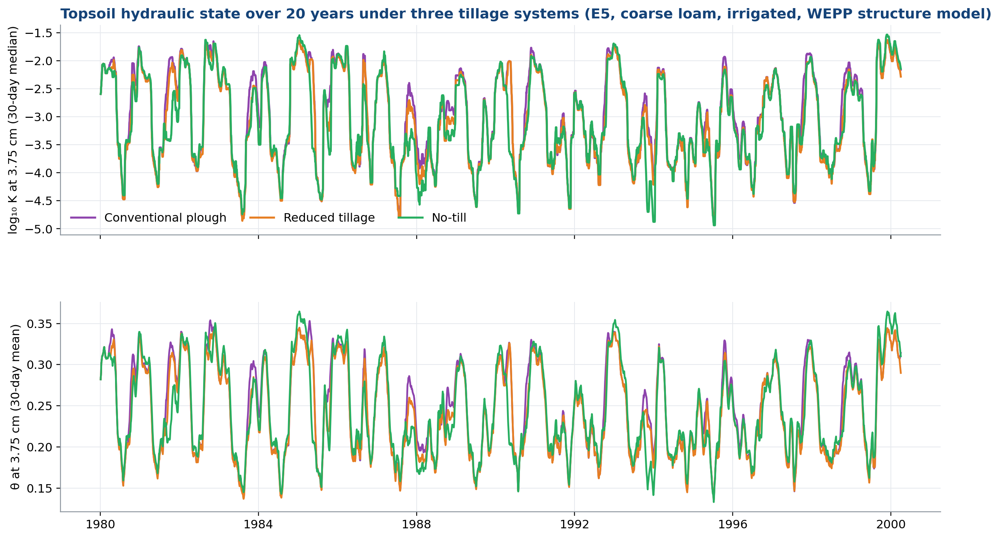

*Daily log10 K and θ at 3.75 cm (30-day rolling statistics), E5 re-runs.* (data: E5 daily)

Topsoil conductivity and water content swing with every wetting and drying cycle because the surface layer equilibrates quickly with rain, irrigation and evaporation. K changes by about three orders of magnitude (log₁₀ K from roughly −1.5 to −5) as the water content moves, because conductivity depends steeply on how many pores are water-filled (Fig. 12). The three tillage systems are almost indistinguishable: in the model, tillage only alters structure slowly through the WEPP consolidation process, so the weather-driven signal dominates the structural one over 20 years.

**Figure 15. Structural degradation rate effects**

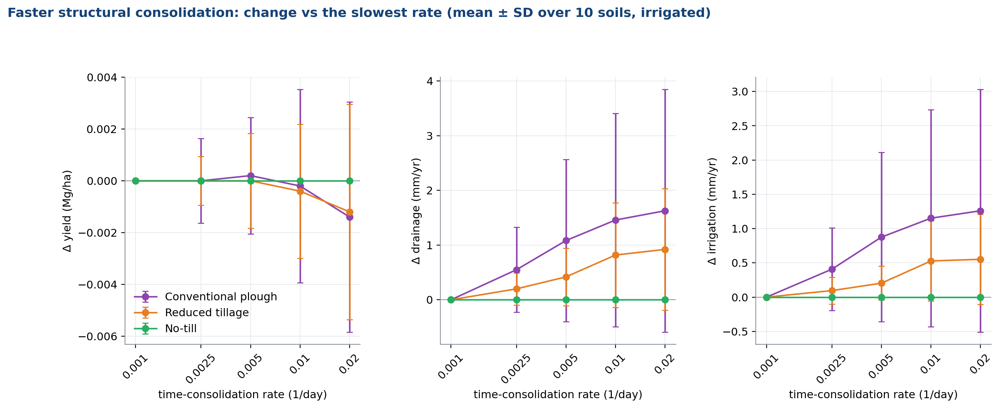

*E5: change in yield, drainage and irrigation relative to tc = 0.001/day, per tillage system.* (data: E5)

Faster time-consolidation means a loosened topsoil re-densifies sooner after tillage, which slightly reduces its large pores, so it stores a little less water and passes a little more. The effects are small in absolute terms: yield changes stay within about ±0.002 Mg/ha, and drainage and irrigation rise by only about 1-1.5 mm/yr at the fastest rate. They are largest for conventional plough, which is loosened the most and so has the most structure to lose, smaller for reduced tillage, and zero for no-till, where no loosening is imposed. The error bars (SD across 10 soils) are as large as the means, so structural degradation on its own hardly moves the water balance over 20 years.

**Figure 16. Tillage × water-regime interaction**

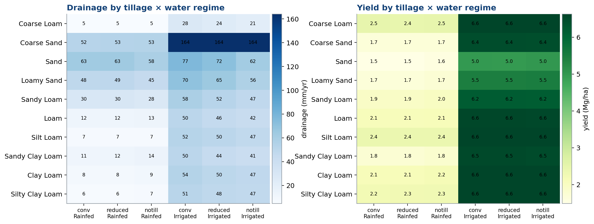

*E5 means over the five consolidation rates.* (data: E5)

The water regime matters far more than the tillage system. Irrigation raises yield by several Mg/ha (for example sand 1.5 → 5.0) and raises drainage sharply where storage is small (coarse sand from about 52 to 164 mm/yr), because water added to a soil that cannot hold it percolates below the root zone. Within a regime the three tillage systems differ by only a few mm of drainage and about 0-0.1 Mg/ha of yield; no-till drains slightly less in irrigated coarse loam (28 → 21 mm) because, in the model, its unloosened, structurally stable topsoil holds water slightly longer than plough-loosened soil.

**Figure 17. Wetting to drying loops**

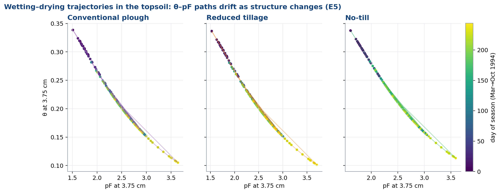

*Daily θ vs pF at 3.75 cm through the 1994 season for each tillage system.* (data: E5 daily)

Each dot is a day, and the points lie on essentially one curve because water content and suction at a given depth are tied together by the soil's retention relationship, so a wetting-drying cycle just moves the state up and down the same curve (the retention curve is single-valued in this setup). The colour gradient and the slight drift show structural change through the season: as the topsoil consolidates, a given suction corresponds to a slightly different water content. Conventional plough drifts the most and no-till the least, matching the ordering of the consolidation effects in Fig. 15.

#### C. Coupled Water Fluxes

**Figure 18. Water-flux Sankey, loam vs sand**

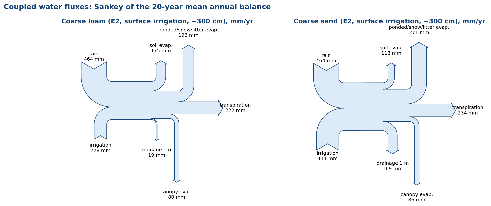

*Mean annual inputs (rain, irrigation) and outputs (T, E, interception, other evaporation, drainage) from E2 at the course trigger.* (data: E2)

The same 464 mm of rain ends up in very different places. In coarse loam, 228 mm of irrigation supports 222 mm of transpiration with only 19 mm of drainage. In coarse sand, 411 mm of irrigation is needed for about the same transpiration (234 mm), and 169 mm drains below 1 m. Sand cannot store water in the root zone, so each application is partly lost below the roots and more water has to be applied to keep the crop supplied. Evaporation from ponded water, snow and litter is also larger in sand (271 against 196 mm), because more water is applied and wets the surface. The arrows are drawn to scale, so the width of each flow is directly comparable between the two soils.

**Figure 19. Seasonal E/T partitioning**

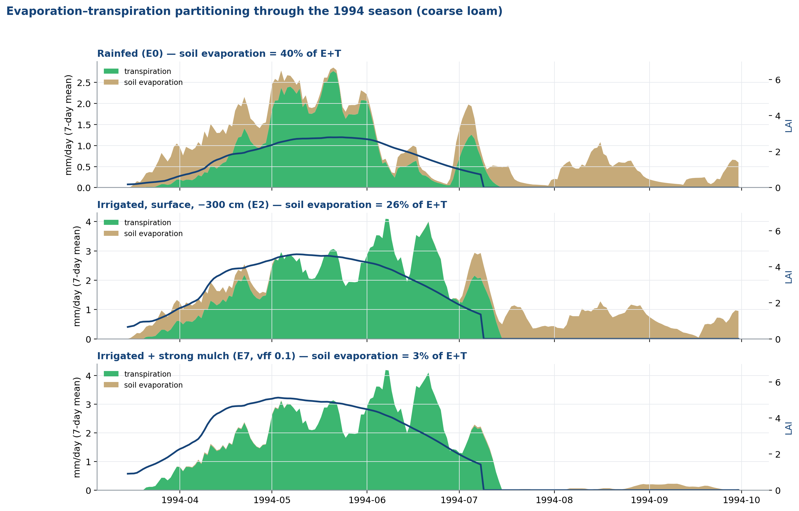

*Daily transpiration and soil evaporation (7-day means) with LAI, rainfed vs irrigated vs mulched.* (data: E0,E2,E7 daily)

The share of soil evaporation in total water loss falls step by step as management adds cover between the soil and the atmosphere. Rainfed, evaporation is 40% of E+T because canopy cover is intermittent and rain wets bare soil between growth stages. Irrigating at the surface wets the soil directly at each event, but the crop also grows better, so canopy shading rises and evaporation's share falls to 26%. Strong mulch removes almost all of the remaining surface exposure, dropping evaporation to 3% of E+T: transpiration becomes the water loss, which is the intended effect of mulch. LAI (black line) rises and falls together across all three panels because the crop calendar is the same; what differs is how much of the ground beneath the canopy is left bare to evaporate from.

**Figure 20. Daily drainage vs rain events**

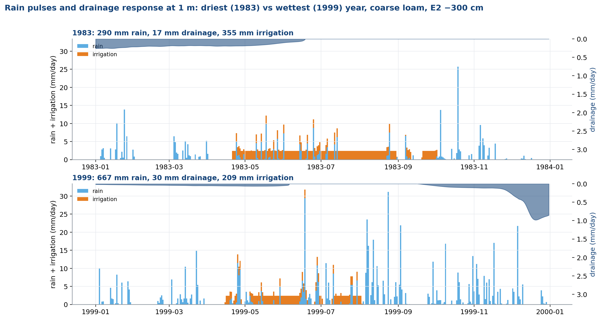

*Daily rain and irrigation (bars, top) and drainage at 1 m (shaded, inverted) in the driest and wettest years.* (data: E2 daily)

Drainage responds to a threshold in stored water, not directly to rain. In 1983 (290 mm rain, a dry year) irrigation supplied 355 mm to keep the crop alive, but the soil rarely filled enough to drain, so only 17 mm left the profile below 1 m all year. In 1999 (667 mm rain, a wet year) irrigation demand was lower (209 mm) because rain did most of the work, but with far more total water arriving, drainage rose to 30 mm. The rain and irrigation bars are dense and irregular through both years, while drainage (the shaded band) only responds after the profile is already close to full, which is why the two panels look so different even though total water input (rain plus irrigation) is not that different.

**Figure 21. Cumulative fluxes by method**

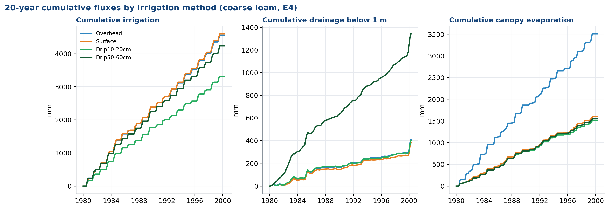

*Cumulative irrigation, drainage and canopy evaporation 1980 to 2000 for four methods.* (data: E4 daily)

Irrigation method decides where water is placed, and that changes how much of it a plant can intercept before it either drains or evaporates. Overhead irrigation wets the whole surface repeatedly, so it accumulates the most cumulative irrigation (over 4,000 mm across 20 years) and also the most canopy evaporation, because water lands on leaves as well as soil. Deep drip (50-60 cm) places water below most of the evaporating surface and near the active root zone, roughly halving both cumulative drainage and irrigation relative to overhead. Surface drip sits between the two. This is the same water-placement logic as Fig. 23-24, shown here as a running 20-year total rather than an annual mean, so the gap between methods can be seen compounding year on year.

**Figure 22. Partitioning by method × soil**

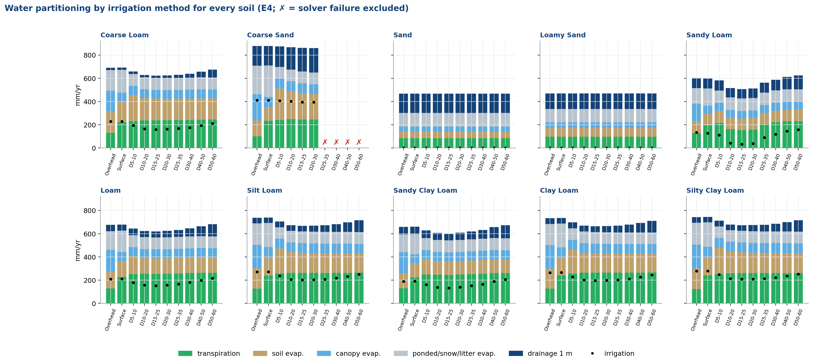

*Stacked mean annual fluxes for 10 methods in all 10 soils; dots = irrigation.* (data: E4)

The same ranking of methods (overhead wettest, deep drip driest at the surface, see Fig. 21) repeats on every soil, but the total bar height and the drainage share both scale with the soil's own water-holding capacity. Coarse sand needs by far the most total water input (the tallest bars) and loses the largest share of it to drainage (dark blue), because it cannot retain what is applied. On loam and the finer soils the bars are shorter and the transpiration (green) share is larger, because more of what is applied is actually used by the crop rather than lost below the roots. This is essentially the Sankey diagram of Fig. 18 repeated for every soil and method at once, which is why the sand panel needs a much larger y-axis worth of water to reach the same crop outcome as the other nine soils.

**Figure 23. Drip depth vs drainage and evaporation**

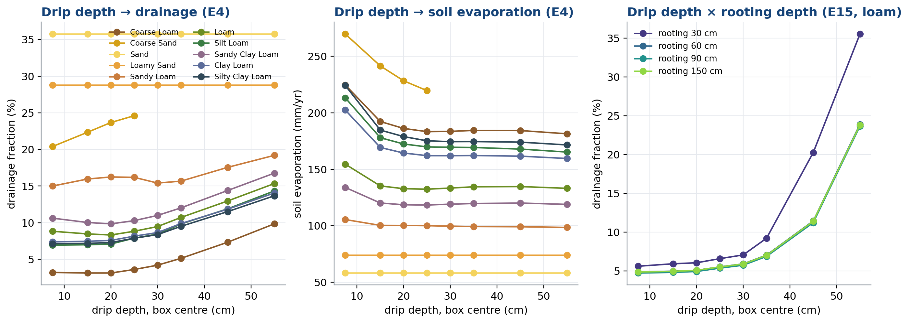

*E4 lines per soil; E15 averaged over the 10 amounts per rooting depth.* (data: E4,E15)

Placing the drip line deeper moves water closer to where roots are actively extracting it and further from the surface where it can evaporate, so both drainage and soil evaporation fall as drip depth increases, most sharply in the first 20-30 cm (left and centre panels). Sand is the exception in the drainage panel: its drainage fraction stays high (around 30%) regardless of depth, because the soil's own poor retention, not the placement depth, is what is losing the water. The right panel shows the effect only becomes large once the rooting depth is shallow relative to where water is placed: at a 150 cm rooting depth, drainage fraction stays low even as drip depth increases, because roots can still reach the water; at a 30 cm rooting depth, drainage fraction rises sharply once drip placement goes deeper than the roots can follow.

**Figure 24. Method × rooting depth × amount**

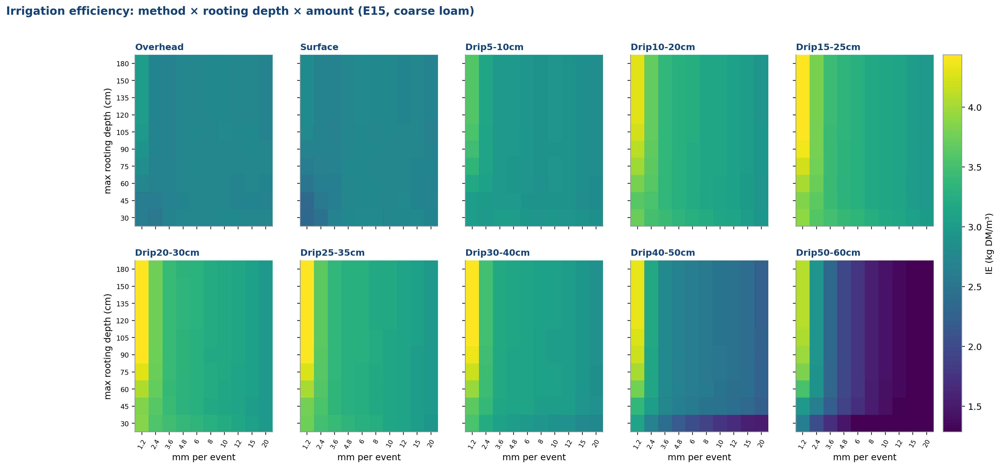

*IE for 1,000 runs; each panel one application method.* (data: E15)

Irrigation efficiency (yield per m³ applied) is highest, in yellow, where placement depth is well matched to rooting depth: for a given method, moving too far below where roots can reach wastes water below the point of uptake, which is why every panel dims toward its bottom-right, i.e. deep placement paired with a shallow root zone. Larger application amounts (mm per event) also tend to reduce IE within each panel, because bigger pulses are more likely to exceed what the root zone can immediately use. The deep-drip panels (bottom row) show a wider spread than the shallow methods, because deep placement makes the match to rooting depth much more consequential: get it right and IE is high, get it wrong (dark purple) and it falls further than a shallow method ever does.

**Figure 25. Annual drainage vs water input**

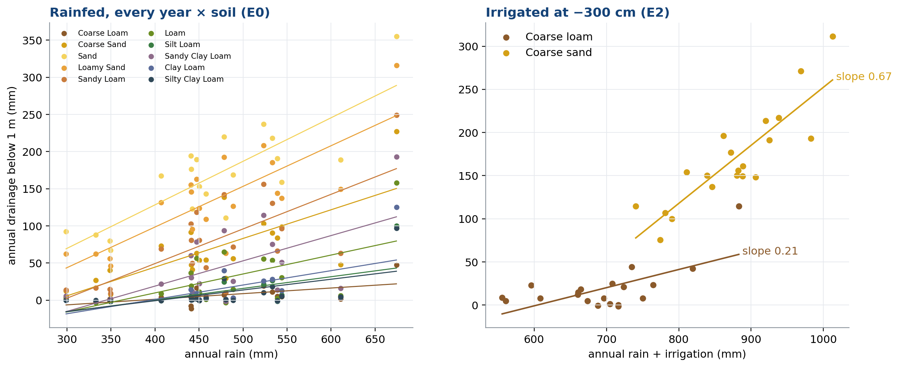

*One point per year; lines = linear fits per soil.* (data: E0,E2 per year)

Every extra mm of water input, whether rain or irrigation, has to go somewhere once the crop's demand is met, and the slope of each fitted line is the marginal share that goes to drainage. Coarse sand's slope (0.67, right panel) is far steeper than coarse loam's (0.21), because sand's small water-holding capacity is filled quickly, after which almost every additional mm drains straight through. The left panel (rainfed, all ten soils) shows the same ordering: the lightest, coarsest soils have the steepest slopes, and the effect compounds with irrigation added, because irrigation is applied precisely to keep the profile topped up, which is also when it is most likely to overflow into drainage on a coarse soil.

**Figure 26. Profile pressure-head evolution**

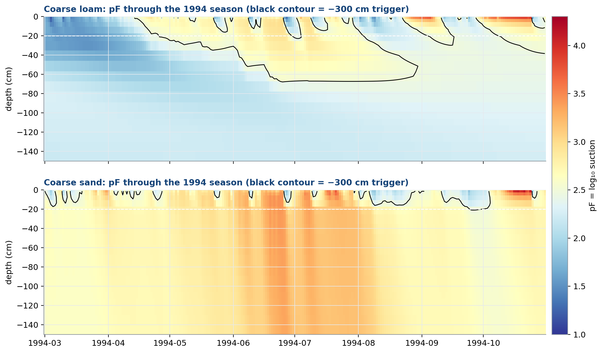

*Depth × date pF with the trigger iso-line; dashed line = sensor depth.* (data: E2 daily)

The black contour is the −300 cm trigger line, so where it sits and how far it moves shows how differently the two soils are managed by the same rule. In coarse loam the contour stays fairly stable and close to the surface through the season, because the soil's moderate conductivity and larger available water capacity let a single trigger keep the root zone in a narrow suction band. In coarse sand the whole profile swings through orange/red (drier) far more often and more abruptly, because sand's small buffer capacity means the same trigger is crossed and re-crossed on the timescale of days rather than weeks, forcing more frequent, larger swings in profile suction between irrigation events (consistent with Fig. 28's tensiometer trace).

**Figure 27. Year-to-year variability**

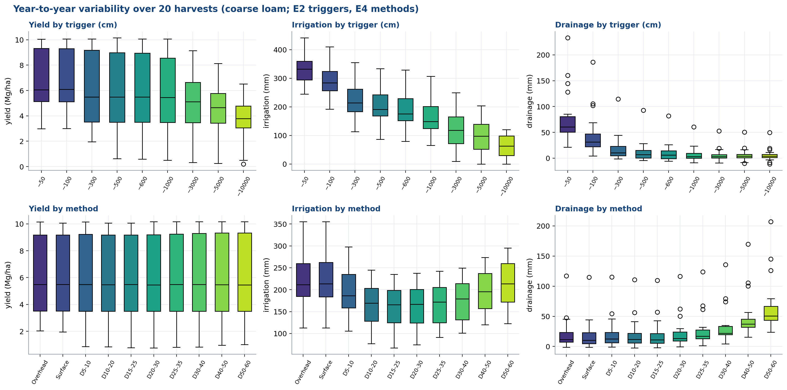

*Boxplots across the 20 harvest years for each trigger and method.* (data: E2,E4 per year)

Both trigger and method act mostly by shifting the whole distribution up or down rather than by changing its spread: a wetter trigger (more negative, further left in each panel) raises yield and irrigation and lowers drainage across nearly all 20 years at once, and the boxes shrink as the trigger gets wetter because the crop is rarely water-stressed regardless of the particular year's rain. The same is true across irrigation methods; the differences in the medians (Fig. 21-22's ranking) are larger than the year-to-year spread within any one method. This confirms the management effect from Figs. 21-24 is systematic, not an artefact of a few unusual years, since it holds up consistently across two decades of different weather.

#### D. Irrigation Control

**Figure 28. Sensor suction time series**

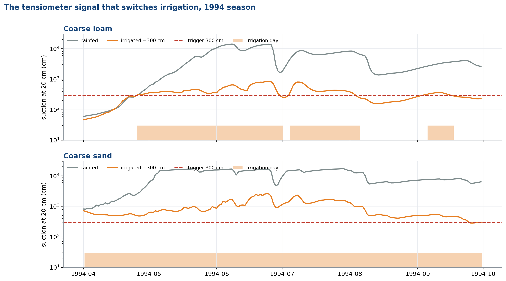

*Daily suction at 20 cm (log) with the trigger and irrigation days.* (data: E0,E2 daily)

This is the signal the irrigation controller actually reacts to. Under rainfed conditions (grey), suction climbs steadily as the soil dries between rains, reaching values far above the trigger. Under the −300 cm rule (orange), suction is capped: every time it approaches the dashed threshold, an irrigation event (shaded band) is triggered and pulls suction back down. Coarse sand needs almost continuous irrigation (June-September is one long shaded band) because its suction rises quickly once the small water reserve is used; coarse loam needs only a few separated events, because its larger buffer takes longer to dry down to the trigger. This is the mechanism behind Fig. 23's finding that events per year differ so much by soil.

**Figure 29. Trigger pressure response**

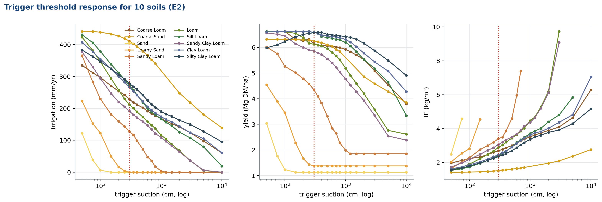

*Irrigation, yield and IE vs trigger for each soil.* (data: E2)

As the trigger gets wetter (moving right along the x-axis, i.e. a smaller magnitude suction number means irrigation starts sooner), irrigation rises because the controller intervenes before much depletion has occurred, yield rises and then plateaus once water stress is essentially eliminated, and efficiency (IE, yield per m³) falls because the marginal water applied near the plateau produces little extra yield. The vertical red line at −300 cm sits past the yield plateau for most soils, meaning it already protects yield; soils that diverge most from the rest, particularly coarse sand (the flattest, lowest curves), are the ones whose retention curve gives them the least buffer, consistent with Fig. 10.

**Figure 30. Sensor depth response**

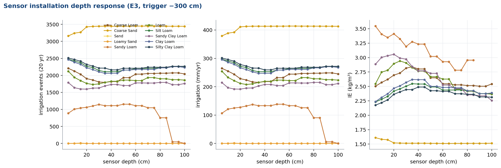

*Events, irrigation and IE vs sensor depth per soil.* (data: E3)

Sensor depth changes how early the controller detects drying, and how early depends on where roots are actively extracting water relative to where the sensor sits. A shallow sensor dries out fast because the topsoil loses water to both evaporation and root uptake, triggering frequent small events (left and centre panels, low depths); a deeper sensor lags behind actual root-zone depletion, so events become less frequent but each one is triggered later, after more of the profile has already dried. Coarse sand (gold) needs by far the most events and irrigation at every depth because of its small buffer capacity (same reasoning as Fig. 25), and its IE stays lowest throughout because, regardless of sensor depth, much of the water applied still drains before the crop can use it.

**Figure 31. Sensor depth × trigger × rain**

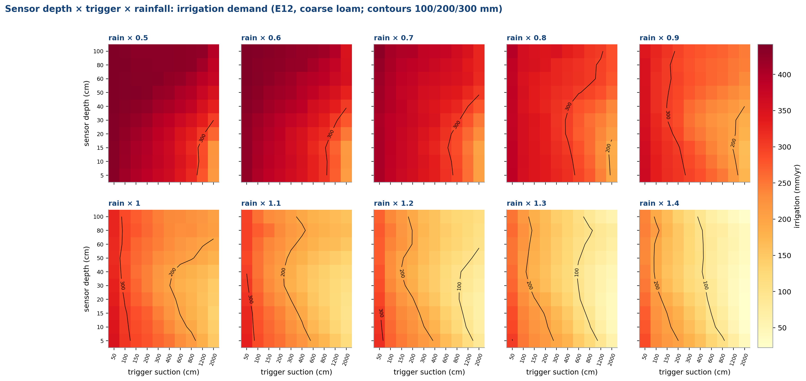

*1,000 runs; each panel one rainfall scaling.* (data: E12)

Sensor depth and rain scale interact rather than acting separately: as rain increases (top row to bottom row), the whole colour scale shifts from red (high demand) to yellow (low demand), because rain substitutes directly for irrigation. Within any single panel, irrigation demand still rises as the trigger gets wetter and, more weakly, as sensor depth increases, but the contour lines (100/200/300 mm) bend rather than running straight, showing that how much a wetter trigger costs in extra irrigation itself depends on how much rain is falling that year. This is why a single 'typical' sensor-depth-and-trigger recommendation is fragile: it is implicitly tuned to one rainfall regime.

**Figure 32. Dose × duration**

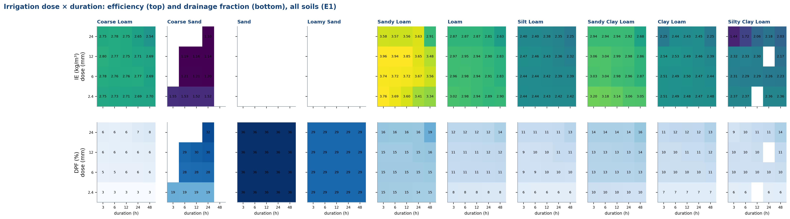

*IE and DPF per soil for 4 doses × 5 durations.* (data: E1)

Longer duration events (same dose, spread over more hours) infiltrate more gently, which raises efficiency slightly and lowers drainage fraction, visible as the mild left-to-right brightening in the top row and darkening in the bottom row. But the much stronger pattern is the missing tiles: coarse sand and sand at low doses solved but produced no meaningful IE and DPF signal, and sand, loamy sand and sandy loam at high dose/short duration are blank because the solver failed to converge, a numerical symptom of trying to force a lot of water into a highly conductive soil in a short time, consistent with those same soils' near-total lack of buffering capacity seen throughout this study (Figs. 13, 25, 29).

**Figure 33. Amount × timing window**

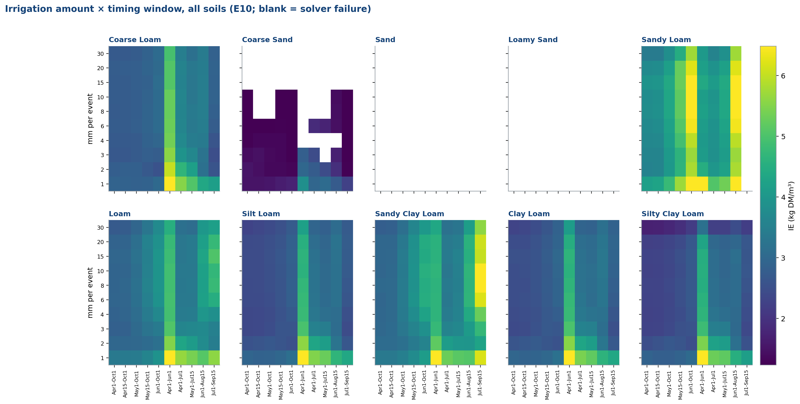

*IE per soil; x = irrigation window, y = amount per event.* (data: E10)

Efficiency (top panels) is highest with an intermediate application amount arriving mid-season (the pale green band, not the extremes), because too little water repeated too often barely relieves stress while too much delivered outside the window when the crop can use it is wasted. Coarse sand's panel is almost entirely dark purple/black across every window and amount, meaning irrigation timing and amount barely matter there. It fails the same way regardless of when water is added, because the soil's own poor retention (not the scheduling) is the binding constraint. The blanks for pure sand and loamy sand are excluded solver failures, the same issue as Fig. 32, again concentrated on the most conductive soils.

**Figure 34. Irrigation production function**

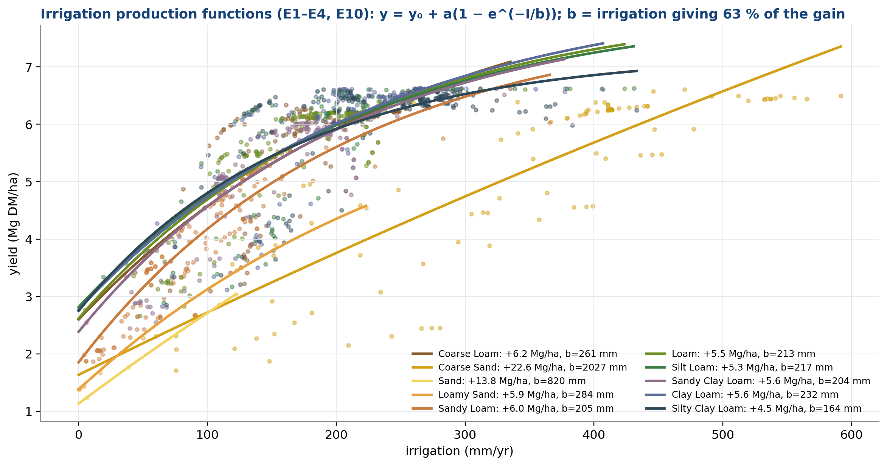

*All irrigated runs; saturating fits anchored at each soil's rainfed yield.* (data: E1-E4,E10)

A saturating curve is what is expected when a single resource (water) relieves stress up to a point, after which the crop's other constraints (radiation, temperature, nutrient supply) start to bind instead, so each further mm of irrigation buys less additional yield. The fitted parameter b is the irrigation amount that already captures 63% of the total possible gain, and it differs by more than 12-fold across soils, from 164 mm in silty clay loam to 2,027 mm in coarse sand, because sand needs to replace, many times over, water that keeps draining away before the crop can use it, whereas silty clay loam retains most of what is applied. The total achievable gain also differs (a = +22.6 Mg/ha in coarse sand against +4.5 to +6.2 Mg/ha on the finer soils), because sand's rainfed yield (Fig. 8) starts so much lower that irrigation has more headroom to fill.

**Figure 35. Irrigation events per year**

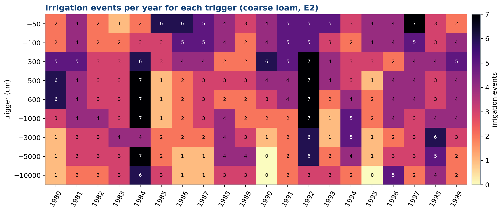

*Number of irrigation starts per calendar year.* (data: E2 daily)

Wetter triggers (top rows, less negative in the label's actual meaning as magnitude but read here as the smaller-magnitude, wetter settings toward −50) force more frequent irrigation because the controller intervenes at a higher (wetter) suction, well before much of the available water is depleted; drier triggers (bottom rows) allow the soil to dry much further between interventions, so fewer, larger events suffice. Wet years (visible as generally cooler columns in certain years) reduce events at every trigger, because rain itself keeps suction below the trigger more often, doing part of the controller's job for free. The scattered black cells (7 events, the maximum shown) mark years and triggers where irrigation was needed almost continuously.

#### E. Evaporation Control and Mulching

**Figure 36. Mulch evaporation reduction × interception**

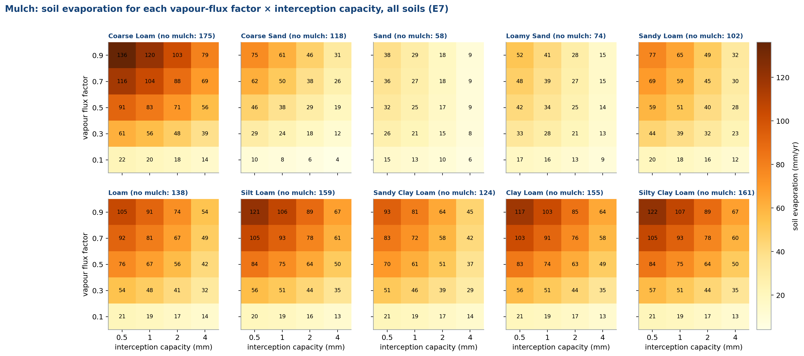

*Soil evaporation (mm/yr); titles give the no-mulch value (E2, −300 cm).* (data: E7,E2)

Both axes control the same thing, how much of the surface's evaporative capacity mulch intercepts, so evaporation falls as either the vapour-flux factor drops (stronger mulch, moving down each panel) or interception capacity rises (moving right). The no-mulch reference value in each title shows how much there was to save in the first place: coarse loam and the finer soils start around 138-175 mm/yr, while sand and loamy sand start much lower (58-102 mm/yr) simply because they hold less water near the surface to evaporate from (Fig. 9). Mulch therefore has the most absolute water to save on the finer, higher-evaporation soils, even though its fractional effect (Fig. 37-38) can look similar everywhere.

**Figure 37. Non-linearity of the mulch effect**

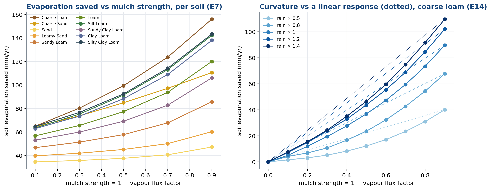

*Saved soil evaporation relative to no mulch; dotted lines = proportional (linear) response.* (data: E7,E14)

Water saved from evaporation rises with mulch strength on every soil, but the curve bends upward (accelerating, not a straight line) rather than tracking the dotted linear reference in the right panel. This is a threshold effect: a thin mulch layer still lets most of the surface dry out between light covers, but as the vapour-flux factor drops further, the remaining exposed fraction of the surface shrinks disproportionately, so the marginal mm of mulch strength saves more water than the previous one. Practically, this means light mulching gives only a modest return, while committing to strong mulch is worth more per unit of material than a linear extrapolation from light mulching would suggest.

**Figure 38. Mulch × rain interaction**

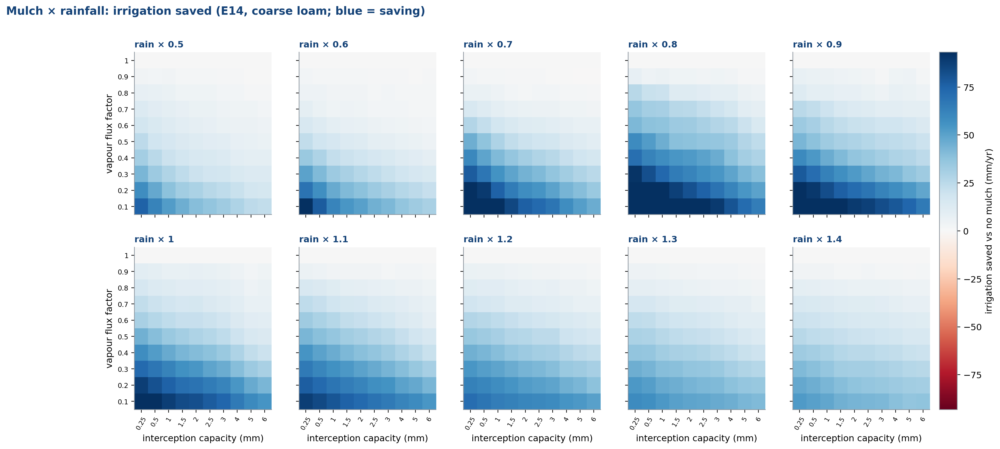

*Irrigation saved relative to vff = 1.0 at the same capacity and rain.* (data: E14)

Saved irrigation depends on both mulch settings and rain together, not on mulch alone: the deepest blue (most saving) sits at low vapour-flux factor and high interception capacity in every panel, but that blue region is largest at low rain scales (top-left panels) and shrinks toward the dry, red corner as rain scale increases. At high rain (bottom-right panels), part of the grid turns red, meaning mulch can, in some settings, cost irrigation rather than save it: with enough rain the profile is already wet, so suppressing evaporation there mostly redirects water to drainage instead of relieving the irrigation controller (the same mechanism as Fig. 3/N2), and in a few combinations the interception layer itself intercepts water that would otherwise have infiltrated, at the margin outweighing the saved soil evaporation.

**Figure 39. Interception loss vs capacity**

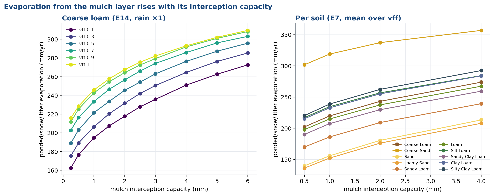

*Evaporation of water held in the mulch/litter layer (with ponded water and snow).* (data: E7,E14)

A mulch or litter layer has its own small storage capacity for intercepted water, and any water held there evaporates directly rather than reaching the soil, so a larger interception capacity means more water is caught and lost at that layer rather than reaching the roots, which is why evaporation from the mulch layer rises with interception capacity in both panels. The left panel shows this saturates as vapour-flux factor increases toward 1 (no suppression at the soil itself, so the mulch layer's own evaporation becomes relatively less important); the right panel shows sand and loamy sand losing the least in absolute terms simply because they have less water arriving at the surface overall (consistent with Fig. 9's lower interception losses on coarse soils), not because their mulch behaves differently.

**Figure 40. Mulch to irrigation substitution**

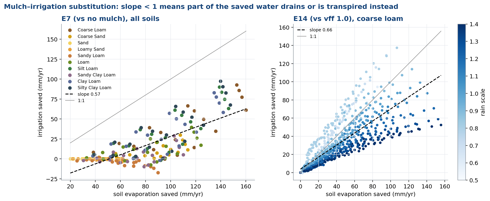

*Irrigation saved per mm of soil evaporation saved; 1:1 line for reference.* (data: E7,E14)

If a mulch-saved mm of soil evaporation were converted one-for-one into a mm of avoided irrigation, every point would sit on the 1:1 line; the fitted slopes (0.57 for E7, 0.66 for E14) show that only a bit over half of the saved water actually shows up as less irrigation, and the rest is redirected to extra transpiration or extra drainage instead, depending on the conditions (this is the mechanism quantified fully in Fig. 3/N2). The right panel's colour gradient makes the rain dependency explicit: points from wetter years (dark blue) sit further below the 1:1 line, meaning proportionally less of the saved evaporation reaches irrigation savings as rain scale increases, exactly the wet-climate drainage-dominant regime described in N2 and N3.

**Figure 41. Soil evaporation factor response**

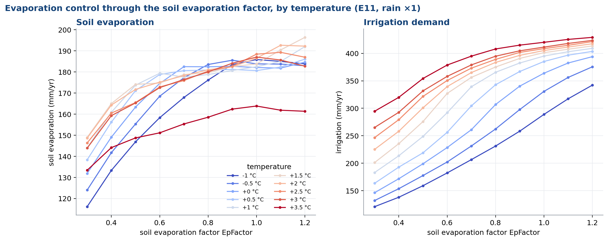

*E11 lines per temperature shift at normal rain.* (data: E11)

Warmer temperatures raise atmospheric demand, so at any fixed soil evaporation factor, both soil evaporation and irrigation demand shift upward as temperature rises from −1 °C to +3.5 °C (left and right panels, red lines above blue). Soil evaporation itself plateaus and even bends down slightly at high EpFactor and high temperature, because once the surface is evaporating close to its atmospheric limit, further increases to the model's evaporation factor input have little left to act on, atmospheric demand, not the factor, becomes the binding constraint. Irrigation demand does not plateau the same way, because the crop keeps needing more water even after surface evaporation has maxed out, which is why the two panels diverge in shape at high EpFactor.

**Figure 42. Mulch benefit by soil**

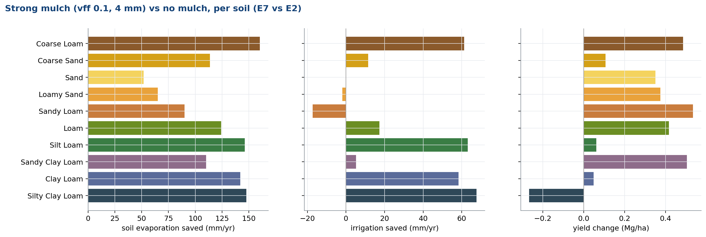

*Differences between the strongest mulch and the unmulched reference.* (data: E7,E2)

These three panels ask the same question three ways, does strong mulch help, and by how much depends heavily on the soil. Fine and medium soils (loam, silt loam, silty clay loam) save the most soil evaporation (140-155 mm/yr) and gain meaningfully in yield, because they had the most surface evaporation to suppress in the first place (Fig. 36) and enough water-holding capacity to redirect the saving into transpiration rather than drainage. Sand and loamy sand barely benefit in irrigation terms (near zero or slightly negative) despite saving a fair amount of soil evaporation, because their poor retention means the saved water mostly drains rather than reducing how much irrigation the controller needs to apply, consistent with Figs. 3/N2 and 40's substitution-slope story.

#### F. Non-Linear Feedbacks

**Figure 43. Temperature × rain response surfaces**

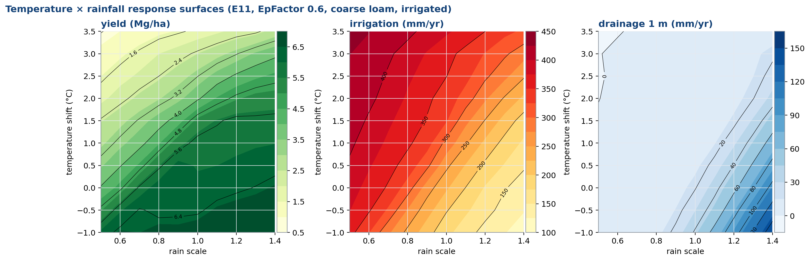

*Filled contours of yield, irrigation and drainage.* (data: E11)

Yield rises with rain and falls with temperature (left panel) because warmth raises atmospheric demand faster than the irrigation controller can fully offset it under this fixed schedule. Irrigation itself increases strongly with temperature at any rain level (centre panel), consistent with the +46 mm/°C effect size quantified in Fig. 5/6. Drainage responds almost only to rain, and barely to temperature (right panel, contour lines nearly vertical), because drainage is set by how much water arrives in total, while temperature mainly redistributes how much of the water present is lost to evaporation and transpiration rather than adding or removing water from the system.

**Figure 44. Threshold detection**

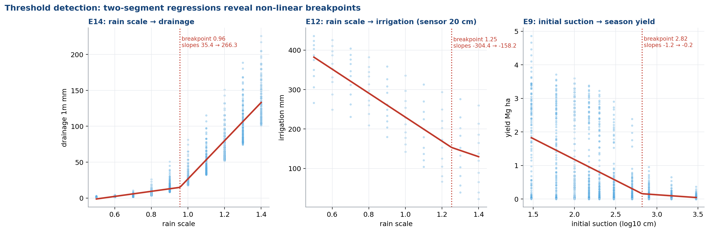

*Grid-search two-segment linear fits; red dotted line = breakpoint.* (data: E9,E12,E14)

A single straight-line fit forces one slope onto the whole range, hiding a change in the underlying mechanism. Drainage vs rain scale (left) is nearly flat below a rain scale of about 0.96 (the profile has spare storage to absorb the extra rain) and then rises 7.5 times faster above it (the profile is full, so extra rain drains almost directly). Irrigation vs rain scale (centre) has a similar but inverted logic: it falls fast with rain up to about 1.25 (rain is substituting directly for irrigation) then falls more gently after that (the controller has already cut irrigation for most events, so there is less left to cut). Yield vs initial suction (right) shows a shallow decline until about 660 cm suction, then a much steeper one, marking the point where the starting soil-water deficit is large enough to constrain early-season growth before the crop can recover.

**Figure 45. Elasticities**

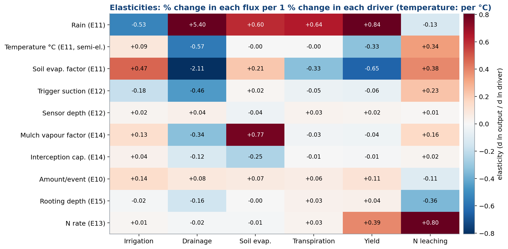

*Log-log slopes of factor-level means (temperature is a semi-elasticity per °C).* (data: E10-E15)

Each cell is how many percent an output changes for a 1% change in a driver, so the colour intensity directly ranks which drivers matter most for which outcome. Drainage is most sensitive to rain (+5.40, deep red) and to the soil evaporation factor (−2.11, deep blue: more evaporation means less water left to drain), both far larger in magnitude than any irrigation-scheduling lever (trigger suction only −0.46). Nitrogen leaching is overwhelmingly driven by N rate (+0.80) rather than by any water-management lever, confirming that, in this system, fertiliser rate is the dominant nitrogen control and irrigation scheduling is a secondary one. The mulch vapour factor's strong positive elasticity on soil evaporation (+0.77) is the single largest management (as opposed to weather) elasticity in the table, underlining mulch as the most leveraged non-irrigation control available.

**Figure 46. Two-way interaction plots**

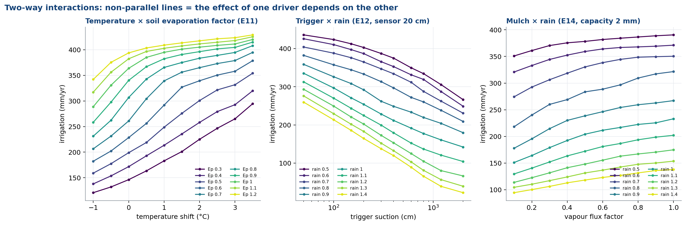

*Mean irrigation for each pair of drivers.* (data: E11,E12,E14)

Parallel lines would mean the two drivers act independently; the fanning pattern in all three panels means they do not. In the left panel, the temperature effect on irrigation is much larger at low soil-evaporation factor (lines further apart at low Ep, colours compressed together at high Ep), because once evaporation is already suppressed, raising temperature has less room to increase irrigation demand further. In the centre panel, the trigger effect flattens out at high rain (lines converge at the right), because rain increasingly does the controller's job regardless of the threshold setting. In the right panel, mulch's effect on irrigation strengthens as rain decreases (lines diverge more at low rain scale), the same mechanism quantified in Figs. 3-4/N2-N3: mulch matters most exactly when water is scarce.

**Figure 47. Rain intensity × starting moisture**

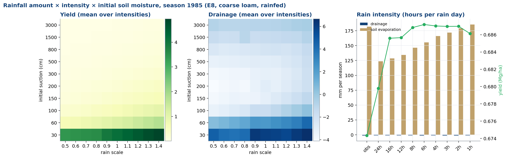

*Heatmaps averaged over intensity; right panel averaged over rain and moisture.* (data: E8)

Yield and drainage both depend overwhelmingly on how wet the soil already is at the start of the season (initial suction, y-axis), and barely on how that same total rain is delivered, in few intense storms or many gentle ones (x-axis in the heatmaps is flat top-to-bottom within any given row). This makes physical sense for a 1-D water-balance model without surface runoff or ponding limits playing a large role at these intensities: what infiltrates eventually reaches the root zone regardless of storm intensity, so total seasonal rain and starting soil water dominate over within-season timing. The right panel confirms this by intensity directly: both drainage and yield stay essentially flat as rain is compressed from many hours per day into few, only soil evaporation drifts slightly.

**Figure 48. Soil × initial moisture × rain**

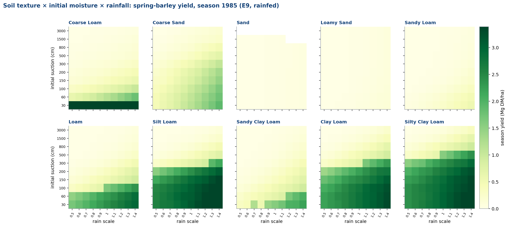

*1,000 single-season runs.* (data: E9)

Yield responds to the interaction of texture, starting soil moisture and seasonal rain, and the panels split cleanly into two groups. Coarse loam, loamy sand and sandy loam through silty clay loam show the expected pattern, yield rises toward the top-left (wet start, high rain), because these soils can retain and use that extra water. Sand and loamy sand are almost blank, near-zero yield everywhere in the grid, because rainfed sand cannot hold enough water between rain events to support the crop regardless of how wet the season starts, the same fundamental limitation seen in Figs. 8, 9 and 25. Coarse sand sits between the two groups, showing a small but visible response, consistent with it having slightly more retention than pure sand (Fig. 13).

**Figure 49. Feedback phase diagram**

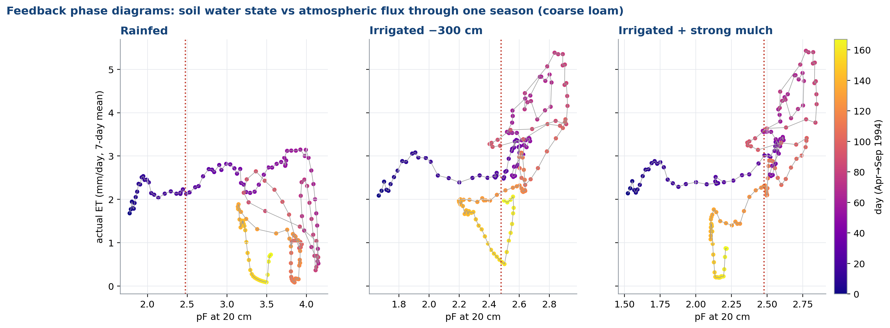

*Daily trajectories of pF at the sensor vs actual ET.* (data: E0,E2,E7 daily)

Each loop traces one season's daily journey through suction-versus-ET space, and its shape reveals how tightly water supply is coupled to atmospheric demand. Rainfed (left), the trajectory swings widely, actual ET collapses toward zero whenever suction crosses the red 2.5 pF line, because the crop is running out of accessible water and can no longer transpire at the atmosphere's demand rate. Irrigated at −300 cm (centre), the loop is pulled toward the left, staying at lower suction, and ET tracks demand far more consistently. With strong mulch added (right), the whole loop compresses into an even narrower suction range, because reduced surface evaporation means the controller has to intervene less often to keep suction low. The progression rainfed to irrigated to irrigated-plus-mulch is a direct visual account of the feedback loop in Fig. 5 tightening step by step.

#### G. Nitrogen Coupling

**Figure 50. N rate × water strategy**

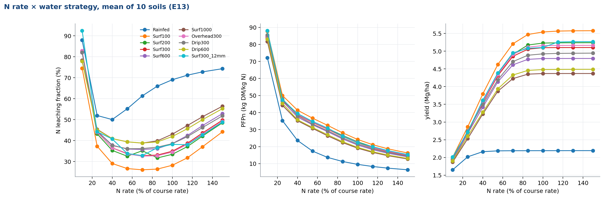

*Means over soils for each of 10 water strategies.* (data: E13)

Higher N rate raises yield up to a point and then plateaus (right panel, all strategies flatten past about 80-100% of the coarse rate), because nitrogen stops being the limiting factor once crop demand is met; further N mostly ends up unused. N-leaching fraction falls sharply as rate increases from very low values then flattens (left panel) because at very low N rates, most of the crop's limited N uptake still leaves a similar residual fraction relative to the (also low) amount applied; the ratio only stabilises once uptake is no longer rate-limited. PFPn (partial factor productivity of N, centre) declines monotonically by definition, since it is yield per unit N applied and yield growth cannot keep pace with a proportionally rising N rate once the yield plateau is reached.

**Figure 51. Mediterranean pathways**

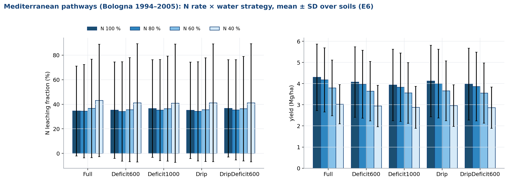

*Bars = means over 10 soils; whiskers = SD.* (data: E6)

The same N-rate-and-strategy logic as Fig. 50 holds in the Bologna climate, but the much larger error bars (± SD across 10 soils) show that soil identity matters more here than in the Taastrup results, because Bologna's more erratic, drier Mediterranean rainfall (Fig. 7) interacts with each soil's own retention behaviour to produce more soil-to-soil spread in both yield and leaching outcomes. The relative ranking of strategies (full, deficit, drip) is preserved, though, meaning the water-management choice still matters in the same direction, just against a noisier, more variable Mediterranean baseline.

**Figure 52. Drainage nitrate concentration**

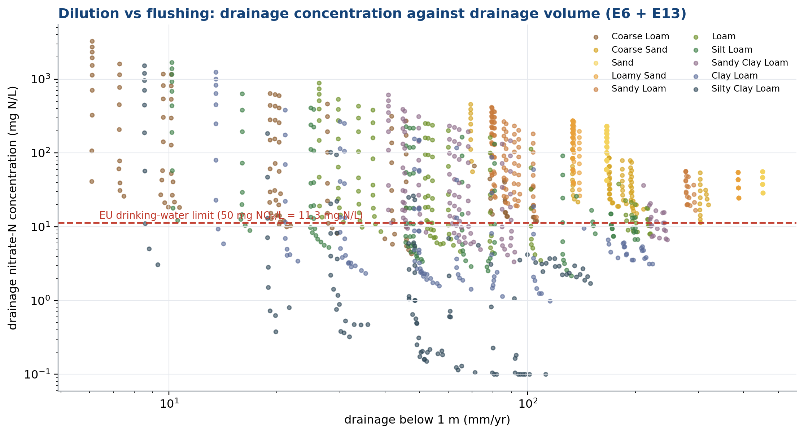

*c = N leached / drainage × 100; log axes; dashed = EU nitrate limit.* (data: E6,E13)

Nitrate concentration in drainage water depends on two things pulling in opposite directions: how much nitrate is present to be leached, and how much drainage water is available to dilute it. Coarse soils (browns/golds, right side of the plot) combine high drainage volumes with a wide concentration range extending to very high values, because water moves through them so fast that leached nitrate has little opportunity to be diluted by slow, steady through-flow. Fine soils (blues/greys, left side) show mostly low concentrations at low drainage volumes, because when they do drain, it tends to be a smaller, more concentrated event, but their much lower drainage volumes overall mean less total nitrate mass reaches depth, consistent with Fig. 6/N-leaching's soil-specific fraction pattern. Many points sit above the EU drinking-water limit line, concentrated on the coarser soils.

#### H. Synthesis

**Figure 53. Edge-case robustness and factor ranking**

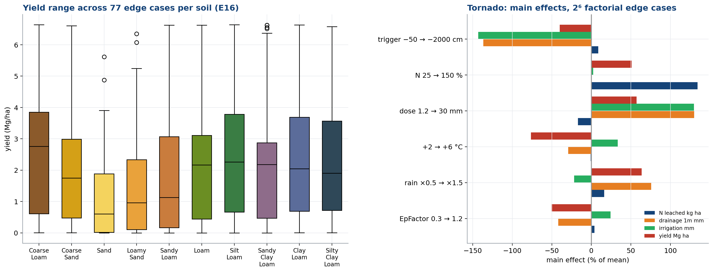

*Left: 77 cases per soil; right: main effects (high − low level) from the 64-case factorial, as % of the mean.* (data: E16)

Coarse loam, loam, silt loam, clay loam and silty clay loam show the widest yield ranges across the 77 stress-tested edge cases (tall boxes), because these soils are responsive to management in the first place, so pushing every factor to an extreme actually moves their yield a lot. Sand, loamy sand and sandy loam show narrow, low boxes, because they are already constrained by their poor water-holding capacity under most edge-case combinations (the same ceiling effect seen throughout, e.g. Figs. 8, 48), so extreme settings cannot push their yield much higher or lower. The tornado panel ranks which single factor swing moves the four tracked outputs the most: the irrigation trigger has by far the largest main effect (up to roughly −150% of the mean on N leached moving from a wet to a very dry trigger), confirming irrigation scheduling as the dominant lever identified throughout this study, ahead of N rate, dose, temperature, rain and the soil evaporation factor.

**Figure 54. Trade-off (Pareto) front**

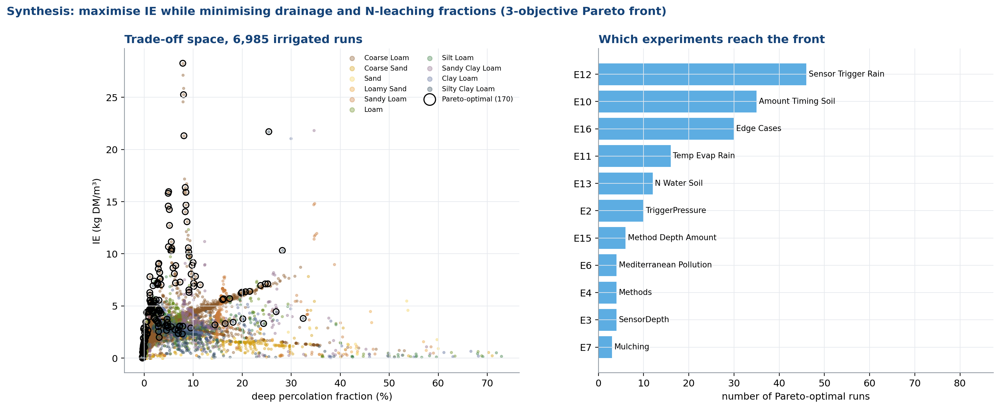

*Non-dominated runs for (max IE, min DPF, min NLF), irrigation ≥ 20 mm/yr.* (data: All)

A Pareto-optimal run is one where no other run does better on all three objectives (high IE, low drainage fraction, low N-leaching fraction) at once, so the front (black-ringed points, left panel) traces the best achievable trade-off given everything the model was asked to try. Runs cluster along a boundary rather than filling the whole space, because the three objectives are not independent, pushing IE higher without increasing drainage or leaching runs into the same soil-physics limits documented throughout (Figs. 1, 9, 25). The right panel shows which experiments actually reach that front: E12 (sensor depth × trigger × rain) and E10 (amount × timing) contribute the most Pareto-optimal runs, meaning the combination of precise trigger control and well-timed, well-sized applications, not any single lever alone, is what gets closest to the achievable trade-off frontier; mulching (E7) contributes the fewest, consistent with its comparatively small, soil-dependent leverage on irrigation quantified in Figs. 40 and 42.

### Additional Figures (02_Additional_Figures)

**Figure 55. Texture triangle**

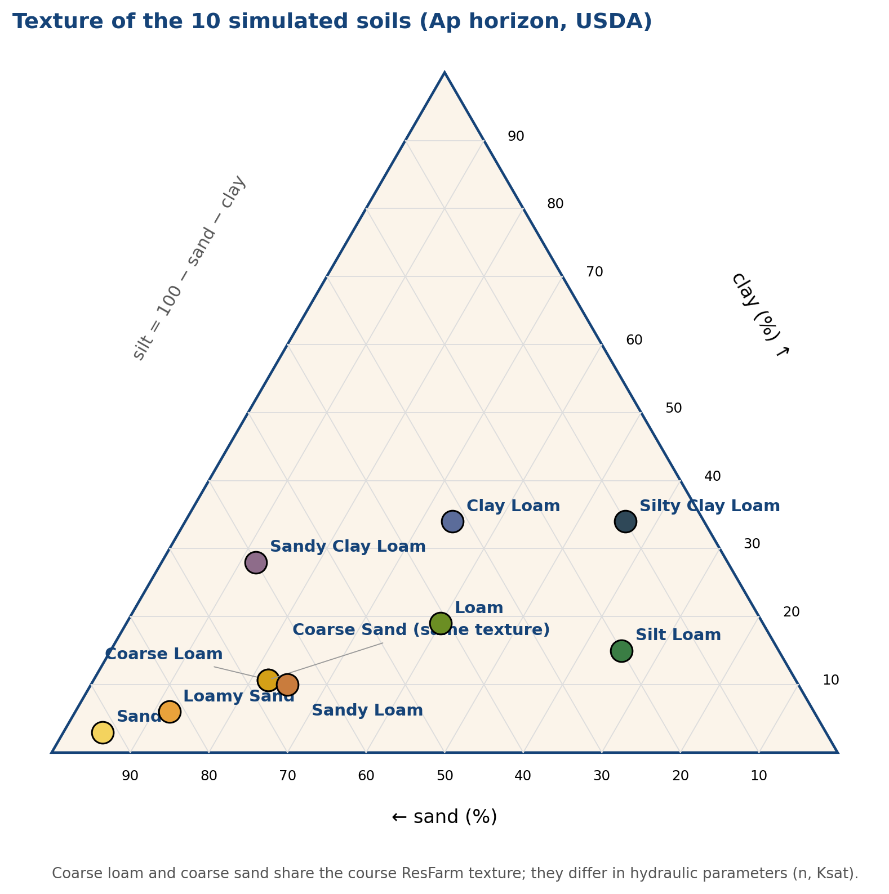

*Sand to silt-clay of each soil from the soil files.* (data: Soil files)

Texture (the sand/silt/clay split) is the raw material the van Genuchten-Mualem hydraulic functions are built from, so this triangle is the physical starting point for every soil-driven pattern in the study. Sand and loamy sand sit in the sand-dominated corner, silty clay loam and clay loam sit toward the clay/silt corner, and the visual spread across the triangle is deliberate: the ten soils were chosen to span the texture space broadly, which is what allows later figures (e.g. Figs. 1, 9, 25) to show clean, monotonic trends against soil properties rather than a narrow, clustered range. Coarse loam and coarse sand share the same coarse ResFarm texture class but differ in their hydraulic parameters (n, Ksat), which is why they can behave differently in later figures despite the similar texture label.

**Figure 56. Pore-domain decomposition**

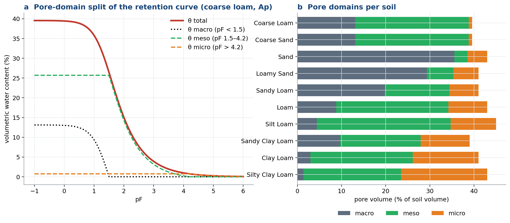

*Macro/meso/micro pore water split at pF 1.5 and 4.2 (after the multi-domain concept in the examples).* (data: Soil files)

Splitting total water content into macro-, meso- and micropore water shows why a retention curve has the shape it does: the steep drop between pF 0 and pF 1.5 (panel a) is macropore water draining under very little suction, because large pores empty first: the long, gentle tail beyond pF 2 is micropore water, held tightly enough that only high suction removes it. Panel b shows this split differs by soil in exactly the way texture predicts: sand and loamy sand are dominated by macropore volume (grey), which drains fast and explains their high Ksat and low TAW (Fig. 13), while silty clay loam has a much larger micropore share (orange), which is what lets it retain water against gravity and gives it the largest TAW of the ten soils.

**Figure 57. Near-saturated conductivity over time**

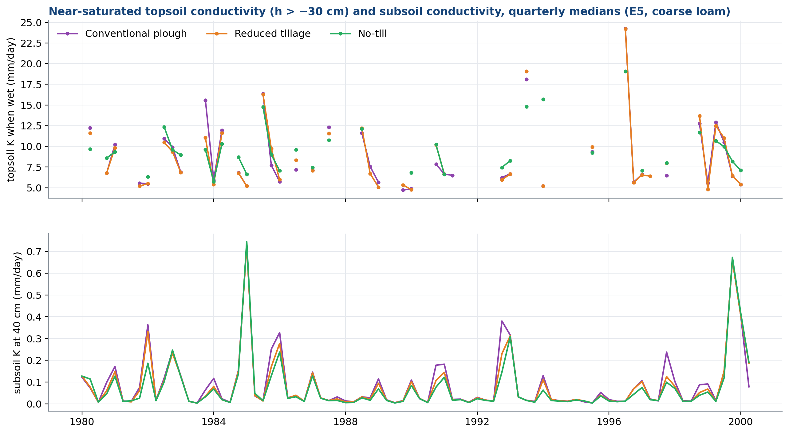

*Topsoil K on wet days (a Ksat proxy) and subsoil K, per tillage system.* (data: E5 daily)

Topsoil conductivity when wet (top panel) is highly variable and occasionally spikes to very high values, because it is measured only on days the topsoil is actually near-saturated, a condition that depends on recent rain or irrigation, so the sampling itself is intermittent. Subsoil conductivity at 40 cm (bottom panel) is smoother and shows a clear repeating seasonal pattern with periodic sharp peaks, because deeper layers respond to the slower, cumulative wetting of the profile rather than to individual surface events. The three tillage systems track each other closely in both panels, the same finding as Fig. 14: over 20 years, weather-driven wetting and drying dominates the conductivity signal far more than the slow structural drift from tillage.

**Figure 58. Seasonal envelopes**

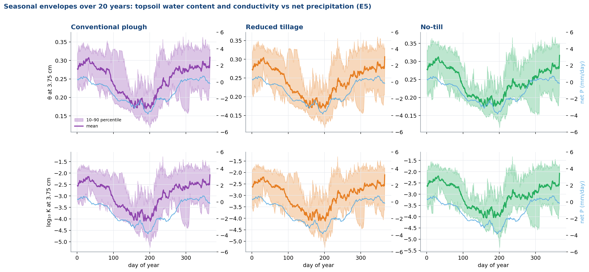

*Mean and 10 to 90 % band by day of year across 1980 to 2000; blue = mean net precipitation (rain − ET₀).* (data: E5, E0 daily)

Plotting mean and 10-90% band together separates the typical seasonal cycle from how much it varies year to year. Topsoil water content (top row) rises through winter and falls through summer in all three tillage systems, tracking net precipitation (rain minus ET₀, blue line) with a lag, since the soil integrates water input over time rather than responding instantly. Conductivity (bottom row, log scale) falls even faster than water content in summer, because conductivity depends non-linearly on saturation (Fig. 12): a moderate drop in θ can mean an order-of-magnitude drop in K. The bands are widest exactly where the mean is falling fastest (into summer), showing year-to-year weather variability matters most during the drying phase, not the wetting phase.

**Figure 59. Evaporation decline after wetting**

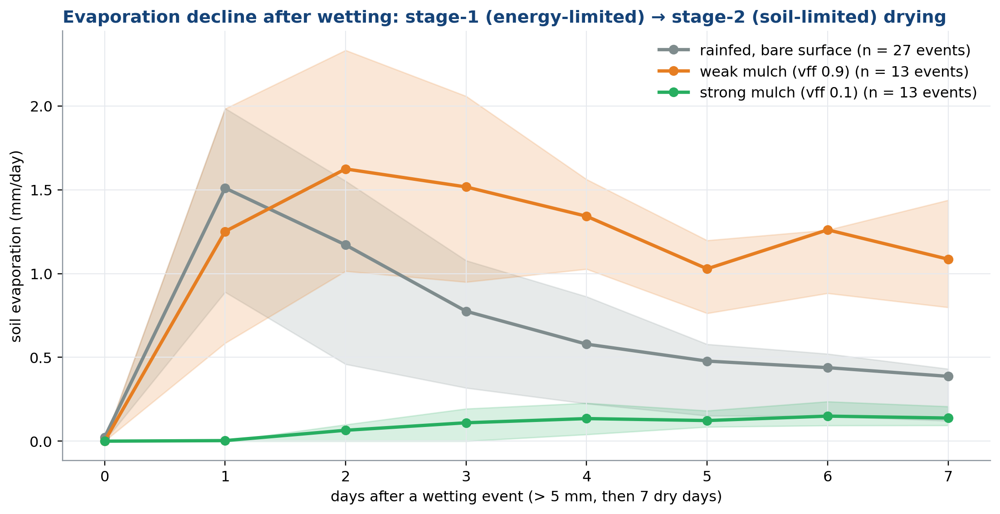

*Composite of all Apr to Sep events 1980 to 2000 (> 5 mm) followed by 7 dry days; band = interquartile range.* (data: E0,E7 daily)

This is a textbook two-stage drying curve, and it shows directly why mulch's effect on evaporation compounds over time rather than being a fixed daily reduction. Stage 1 (day 0-1) is energy-limited: the surface is wet enough that evaporation proceeds at close to the atmospheric demand rate for all three treatments, so the curves start together. Stage 2 begins once the surface dries below what the soil can resupply by capillary rise, and the curves separate sharply: rainfed, bare soil evaporation stays relatively high and declines only slowly, weak mulch behaves similarly to bare soil because it barely impedes vapour loss, while strong mulch collapses almost to zero within a day, because it cuts off the vapour pathway before stage 2 even properly begins. This is the event-level mechanism behind every mulch result in Figs. 3-4, 36-42.

**Figure 60. Model structure with fluxes**

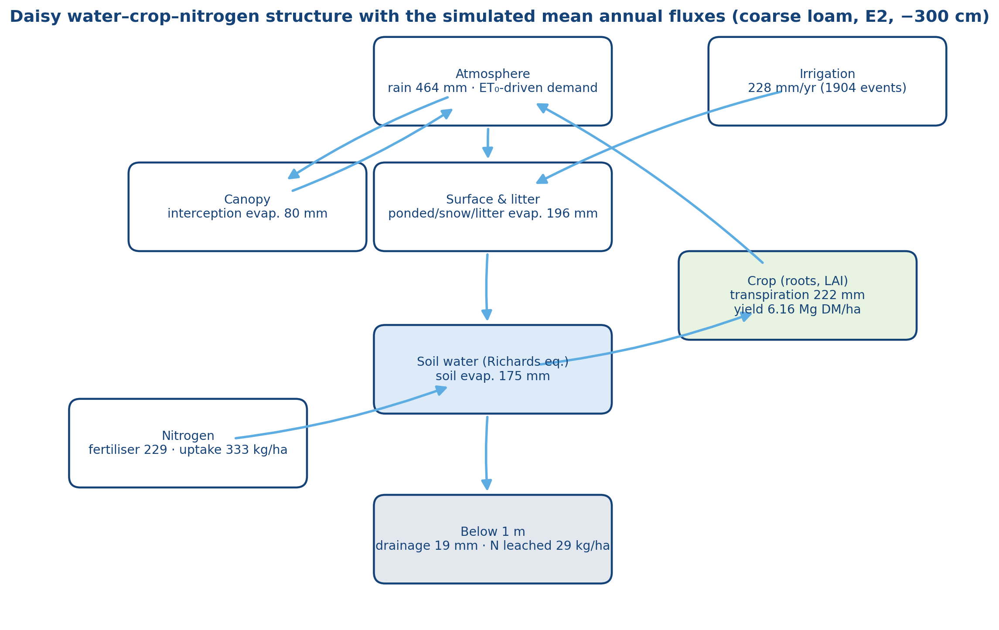

*Model compartments annotated with the 20-year mean fluxes of one run (after the Daisy diagrams in the examples).* (data: E2)

This is the model's own accounting structure, drawn with the actual 20-year mean fluxes for one representative run, so every number here is a totals check for the process-level figures elsewhere in the catalogue: rain (464 mm) plus irrigation (228 mm, 1,904 events over 20 years) enters through the atmosphere box, splits into canopy interception evaporation (80 mm), surface/litter evaporation (196 mm) and the soil-water store; the soil-water store feeds transpiration (222 mm, supporting 6.16 Mg/ha yield) and drainage below 1 m (19 mm, carrying 29 kg N/ha leached), with 175 mm lost directly as soil evaporation. These are the same coarse-loam, E2, −300 cm numbers that anchor the Sankey diagram in Fig. 18, shown here as the underlying model diagram rather than a flow-width chart.

**Figure 61. Root and LAI development**

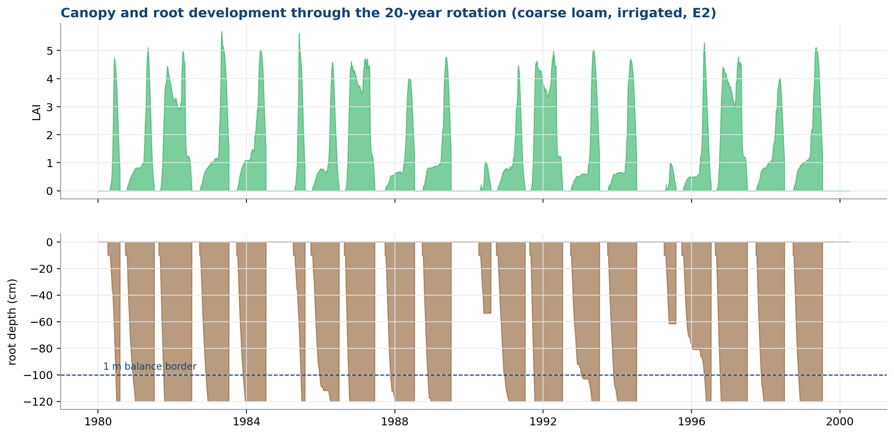

*Daily LAI and rooting depth from the crop module.* (data: E2 daily)

LAI (top) rises and falls sharply each growing season as the crop emerges, canopies and senesces, with a clear rotation pattern repeating roughly every few years matching the barley/rape/wheat sequence. Rooting depth (bottom) deepens over the same season as roots explore downward, then resets between crops; the 1 m balance border line marks the depth below which drainage is counted, so root growth approaching that line is exactly what determines how much of a deep drainage event the crop could plausibly intercept before it happens, a mechanism relevant to Fig. 23's drip-depth-versus-rooting-depth interaction.

**Figure 62. Correlation matrix**

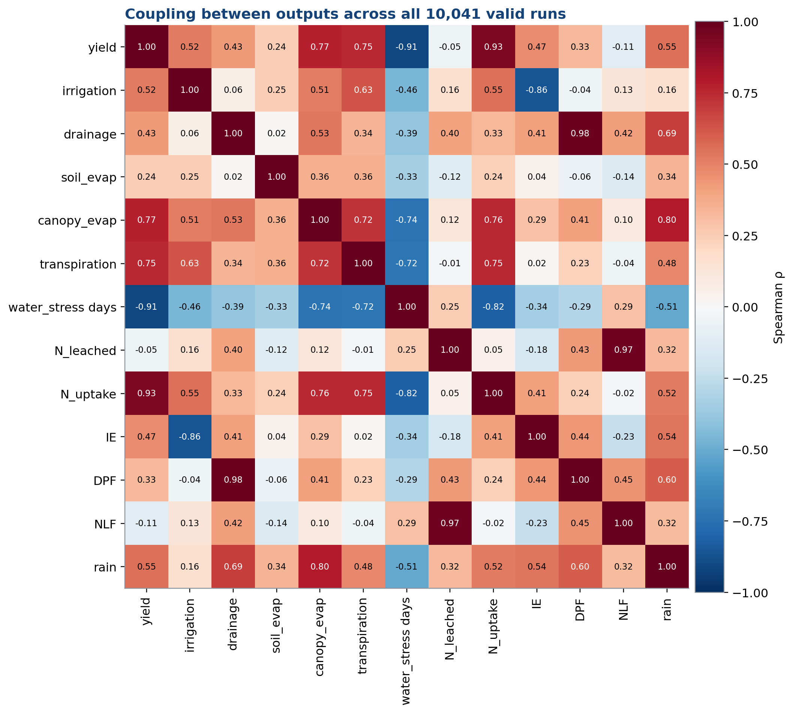

*Spearman rank correlations between long-term outputs.* (data: All)

This is the correlation structure behind nearly every bivariate relationship shown elsewhere in the catalogue, so it works as a map of which figures relate to which. Irrigation and drainage correlate positively (+0.61), consistent with the annual drainage-vs-input slopes in Fig. 25; yield and irrigation correlate positively (+0.46) but yield and drainage correlate weakly, showing the production function (Fig. 34) is not simply mirrored by a water-loss penalty. Water-stress days correlate strongly negatively with yield (−0.91) and IE (−0.67), confirming stress days are close to a direct proxy for the yield loss mechanism used throughout. N-leached correlates most strongly with drainage (+0.56) rather than with N-uptake or rate directly, reinforcing Fig. 45's elasticity finding that leaching is water-transport-limited as much as it is N-supply-driven.

**Figure 63. Random-forest drivers**

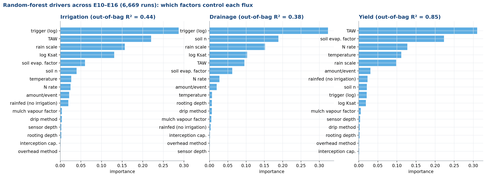

*Impurity-based importance of design factors and soil properties; out-of-bag R² shown. Moderate R² for irrigation/drainage reflects strong soil × management interactions.* (data: E10-E16)

A random forest ranks which inputs it actually needed to predict each output well, independent of any assumption about linearity. Irrigation is most controlled by the trigger setting and TAW together (the two tallest bars are close), which is exactly the soil-gated controllability story of Fig. 1/Key Synthesis stated in predictive-modelling terms rather than correlation terms. Drainage is dominated by soil identity (soil n, log Ksat, TAW) even more than by the management factors, consistent with Fig. 25's finding that soil sets the ceiling on drainage response. Yield achieves the highest out-of-bag R² (0.85) of the three, meaning yield is the most predictable output from these design factors, while irrigation and drainage's more moderate R² (0.44, 0.38) reflects genuine soil×management interaction that a factor-importance ranking alone cannot fully capture, the same interactions quantified directly in Figs. 46 and 67.

**Figure 64. Validation of re-runs**

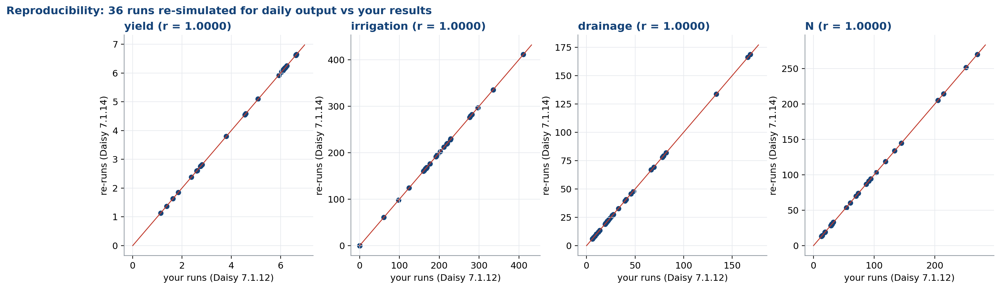

*1:1 comparison; median difference < 0.3 %, all within 2 %.* (data: Re-runs)

Every point sits almost exactly on the 1:1 line (r = 1.0000 for yield, irrigation, drainage and N) because these 36 setups were deliberately re-run with daily output using Daisy 7.1.14 and compared against the original 7.1.12 batch results at the same annual resolution. This is a reproducibility check, not a new experiment: it confirms the daily-resolution figures used elsewhere in the catalogue (e.g. Figs. 19-20, 26, 28, 45, 57-59) are built on results consistent with the main batch run to within 2% (median under 0.3%, as stated in the project README), so conclusions drawn from the daily figures can be read alongside the annual ones without a version-mismatch caveat.

**Figure 65. PCA biplot**

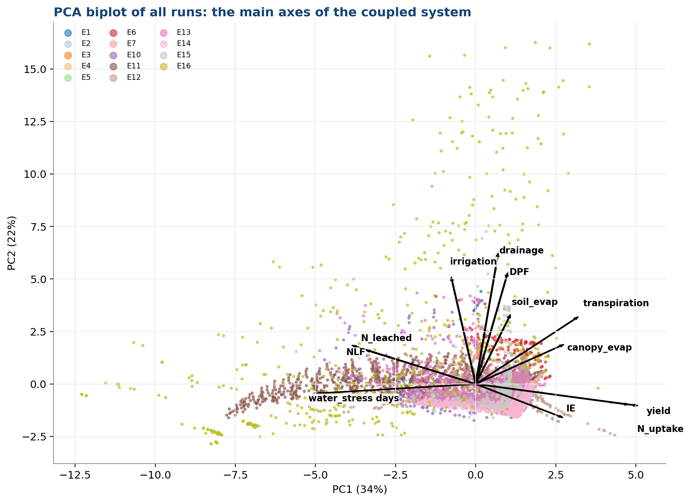

*Standardised outputs; points coloured by experiment; arrows = loadings.* (data: All)

A PCA biplot compresses many correlated outputs into the two directions of greatest joint variation, and the arrow directions show which raw variables move together. Drainage, DPF, irrigation and soil evaporation point in a similar direction (upper right), meaning runs high in one tend to be high in the others, essentially the 'wet, high-throughput' axis of the system. Yield and N-uptake point in a distinct direction (lower right), separate from the water-loss cluster, meaning high yield does not automatically imply high water loss, they are correlated with the input drivers but not mechanically tied to each other. Water-stress days point opposite to yield, the same relationship quantified numerically in Fig. 62. The colour-by-experiment clustering shows E10-E16 (irrigation and mulch experiments) occupy a different region of this space than E1-E7, reflecting their different factor combinations.

**Figure 66. Parallel coordinates of best runs**

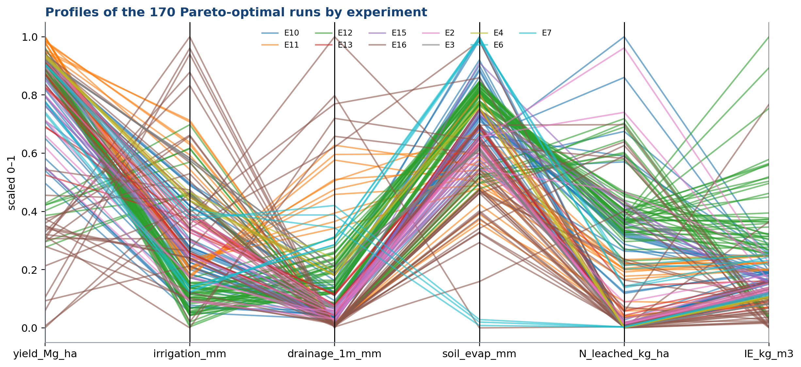

*Each line one Pareto-optimal run (min to max scaled).* (data: Pareto set)

Each line is one of the 170 Pareto-optimal runs from Fig. 54, scaled 0-1 per axis so different units can share one plot; the coloured experiment groups show which parts of factor space actually produce trade-off-optimal outcomes. Lines cluster toward high yield and high IE (left two axes) while staying low on irrigation, drainage, soil evaporation and N-leached (right-hand axes), which is definitionally what Pareto-optimal means here. E12 and E4 (green and dark-yellow families) contribute a visibly dense band of lines, consistent with Fig. 54's finding that sensor-trigger-rain and method experiments dominate the optimal set; the wide vertical spread on the irrigation_mm axis shows Pareto-optimal solutions are not a single recipe, several different irrigation levels can all be optimal depending on which soil and method they are paired with.

**Figure 67. Variance decomposition**

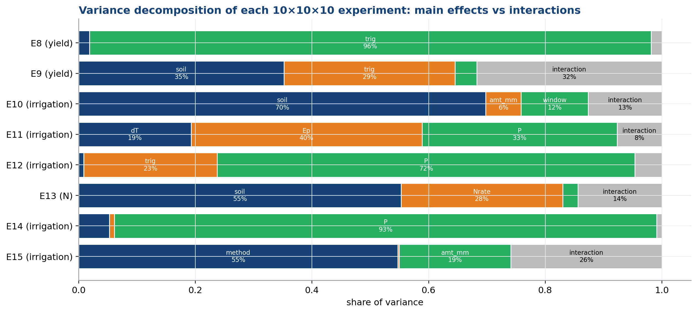

*Main-effect sums of squares per factor; remainder = interactions (non-additivity).* (data: E8-E15)

This decomposes each experiment's outcome variance into how much is explained by each factor's main effect versus how much is left over as interaction (grey). E8's yield is almost entirely explained by soil identity alone (96%, top bar), meaning rainfall intensity and timing barely matter once soil is accounted for, the same conclusion as Fig. 47. E10's irrigation is split roughly 70/17/13% across soil, amount and window, with real but modest interaction. E14's irrigation is dominated by rain (93%), leaving little room for mulch's main effect or interaction to show up in this particular decomposition, even though Figs. 3-4 and 36-42 show mulch's effect is real and rain-dependent, precisely because that dependency is itself an interaction, which this chart's grey segment (8% for E14) is measuring, not erasing. Interaction shares are generally modest (8-32%) across experiments, meaning most of the outcome variance in this study is explained by main effects rather than higher-order interactions.
## License

MIT License, see [LICENSE](./LICENSE).

## Citation

If you use this repository, please cite it as:

Halilu, N. (2026). Coupled Water Fluxes and Pore-Scale Dynamics under Joint Precision Irrigation and Evaporation-Control Mulching: Mapping Non-Linear Soil-Atmosphere Feedback Loops. GitHub repository. https://github.com/halilunaziru73-creator/Coupled-Water-Fluxes-Pore-Scale-Dynamics-Precision-Irrigation-Mulching-Feedback-Loops

## Related work

- [NaCROP](https://github.com/halilunaziru73-creator/NaCROP): reference/crop evapotranspiration, soil-water balance, and irrigation scheduling for five crops around Zaria, Nigeria.
- [Digital Twin for Gully Biocontrol](https://github.com/halilunaziru73-creator/Digital-Twin-for-the-Evaluation-of-Experimental-Gully-Biocontrol-Using-Morning-Glory-Ipomoea-spp): a Bayesian-grounded digital twin for a different soil-water process, gully erosion, validated against real field-sensor data.
- [Geometry-Agnostic Contrastive Learning (GACL)](https://github.com/halilunaziru73-creator/Geometry-Agnostic-Contrastive-Learning-GACL): a separate line of work on crop-disease imaging, unrelated in method but part of the same broader digital-agriculture programme.
